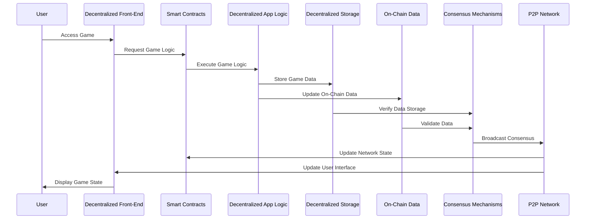
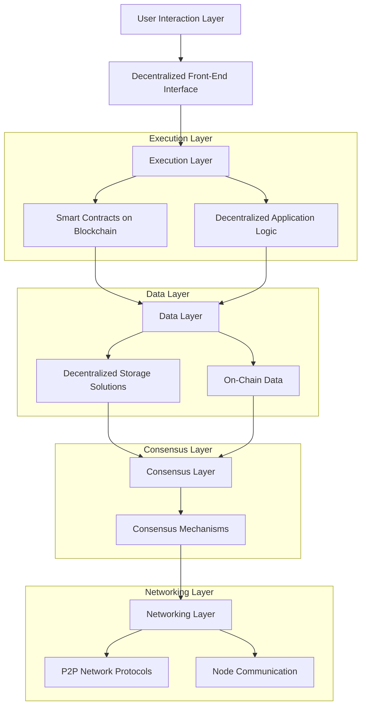
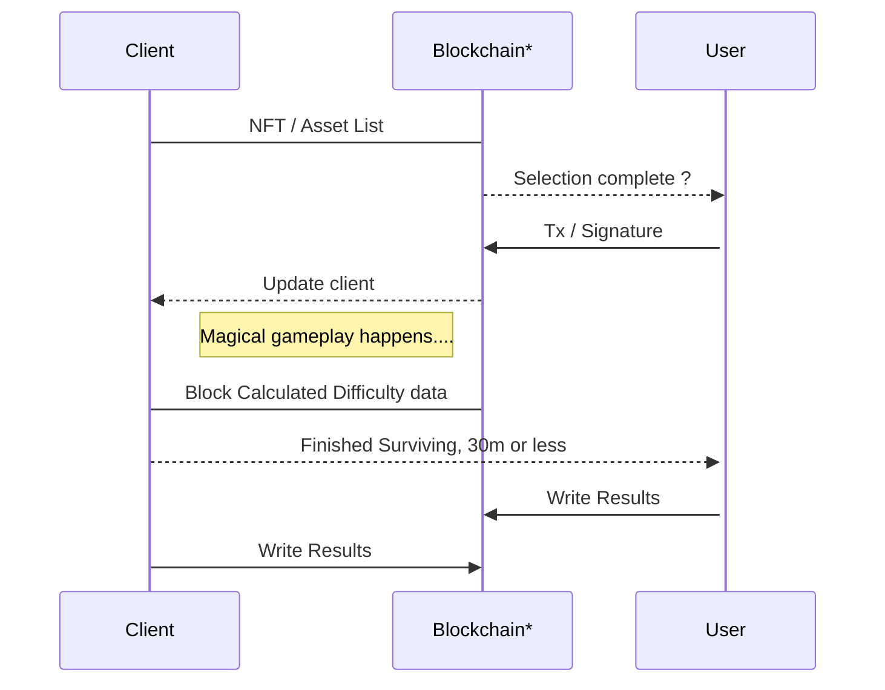
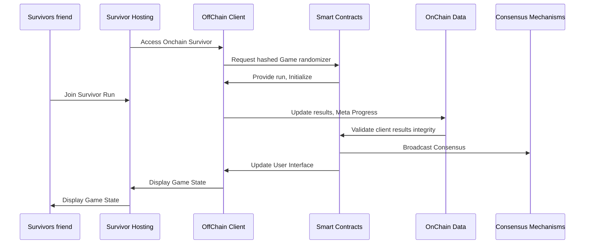

# Buried Ideas
This unordered list includes ideas scrapped during design or production. They are documented here to keep track of them and serve as a reference in case they are needed in the future. 

## 

## Onchain Execution, Ideal design of Onchain Survivor, fully descentralized vertical stack, Initial basic design 
The ideal final arquitectural design concept of executing the game entirely on-chain was scrapped. Instead, a new design was implemented where cryptographic proof ensures that the game client has not been tampered with. This approach maintains the integrity and security of the game while reducing the complexity and cost associated with full on-chain execution.

*Blockchain / RPC

## Generic NFT Traits and Properties
This document contains generic design elements that were initially drafted for the game. During production, these ideas were deemed too generic and were subsequently replaced with a more specific, onchain survivor class-oriented design.

1. Backgrounds

* Cyber City
* Neon Desert
* Digital Jungle
* Quantum Abyss
* Metaverse Market

2. Characters

* Hacker
* Cyber Samurai
* Space Ranger
* AI Entity
* Bio-enhanced Survivor

3. Outfits

* Stealth Suit
* Battle Armor
* Casual Wear
* Sci-Fi Robes
* Space Suit

4. Weapons

* Laser Sword
* Plasma Rifle
* Quantum Blaster
* Holo-Bow
* Energy Shield

5. Accessories

* Holo-Goggles
* Robotic Arm
* Jetpack
* Data Pad
* Crypto Amulet

6. Power-ups

* Speed Boost
* Shield Generator
* Healing Nanobots
* Invisibility Cloak
* EMP Grenade

7. Expressions

* Determined
* Angry
* Smirking
* Focused
* Battle-Ready

## Old Table of Contents🧩
Old table of contents used in the initial tests. 

1. [Onchain Survivor](#onchain-survivor)
2. [About the Project](#about-the-project)
   - [Key Features](#key-features)
3. [Onchain Survivor Dynamic Difficulty Scaling](#onchain-survivor-dynamic-difficulty-scaling)
4. [Getting Started](#getting-started)
   - [Prerequisites](#%EF%B8%8prerequisites%EF%B8%8F)
   - [Installation](#installation)
5. [How to Play](#how-to-play)
6. [Contributing](#contributing)
   - [Fork the Repository](#fork-the-repository)
   - [Create a New Branch](#create-a-new-branch)
   - [Commit Your Changes](#commit-your-changes)
   - [Push to the Branch](#push-to-the-branch)
   - [Open a Pull Request](#open-a-pull-request)
7. [License](#license)
8. [OnChain Survivor NFT Series, "The Survivors"](#-onchain-survivor-nft-series-the-survivors--)
9. [Basic Interaction Models](#-basic-interaction-models-%EF%B8%8F)
   - [Sequence Diagrams](#sequence-diagrams)
   - [Flowcharts](#flowcharts)
10. [Acknowledgments](#-acknowledgments)
11. [Contact](#-contact)

## Enemies

# Rug:
Description: A sneaky trap that appears randomly, causing the player to fall and die instantly.
Icon: A cartoon rug with a mischievous face.
Tooltip: "Avoid this pitfall! Not every rug can be trusted."

# Frontrunning Bot:
Description: Moves quickly and targets the player with precise attacks.
Icon: A sleek robot with a visor.
Tooltip: "Always one step ahead. Can you keep up?"

# Sniper Bot:
Description: Attacks from a distance with high precision.
Icon: A robot with a long-range scope and crosshair eyes.
Tooltip: "It's got you in its sights. Better keep moving!"

# MEV Bot:
Description: Manipulates the environment to create hazards for the player.
Icon: A robot with a calculator head and gears.
Tooltip: "Maximize your evasion, or get caught in its schemes!"

# Gas Cloud:
Description: Creates hazardous areas that slow and damage the player.
Icon: A green, smoky cloud with toxic symbols.
Tooltip: "Gas fees aren't the only thing that'll slow you down."

# Node Failure:
Description: Causes environmental disruptions, creating obstacles and damaging zones.
Icon: A flashing red node with warning signs.
Tooltip: "Network issues ahead! Dodge the disruptions."

# Maps

## Shitcoin Trenches 🌾
A chaotic marketplace where traders buy and sell volatile assets. Expect rapid changes and unpredictable hazards.

## The Citadel 🏰
A secure and fortified area where only the elite survive. High walls and strong defenses protect against waves of enemies.

## Underwater Trade City 🌊
A bustling underwater metropolis where commerce thrives. Navigate through underwater tunnels and avoid lurking dangers.

## Mining Caverns ⛏️
Dark, deep tunnels filled with valuable resources and dangerous enemies. Keep an eye out for falling rocks and hidden traps.

## DeFi Jungle 🌴
A dense and overgrown jungle where decentralized finance rules. Maneuver through thick foliage and evade lurking predators.

## Rug Pull Swamp 🪤
A treacherous swamp full of hidden traps. One wrong step can lead to instant doom as the ground disappears beneath you.

## Gas Fee Desert 🌵
A vast, arid desert where movement is slowed by high gas fees. Plan your path carefully to avoid getting stranded.

## Node Network Hub 🌐
A bustling hub of activity where nodes connect. Navigate through a maze of connections and defend against network attacks.

## Governance Hall 🏛️
A grand hall where decisions are made. Influence the battlefield by participating in governance votes and passing upgrades.

## Quantum Data Stream 🔍
A futuristic, digital landscape where data flows freely. Use the streams to your advantage and avoid being caught in the current.

## Bot Marketplace 🤖
A busy market where trading bots roam. Outwit the bots and use their strategies to your advantage.

## Hacker's Hideout 💻
A shadowy, secret location where hackers plot. Avoid traps and counter their attacks with your own skills.

## Decentralized Village 🏡
A quaint village where decentralization is the norm. Work together with allies and fend off waves of enemies.

## Smart Contract Plaza 📜
A bustling plaza where smart contracts are created. Use the contracts to summon allies and enhance your abilities.

## Validator's Fortress 🏯
A stronghold where validators maintain the blockchain. Defend the fortress and ensure the network's security against relentless attacks.

# Special Events

## The Trenches 🪖
**Description**: The trenches are where traders are desperate and want to exit. Enemies enter a frenzy mode, becoming faster and more aggressive for a short period.

## Matrix Attack ⊹
**Description**: Full-on world vs trader. Dodging incoming attacks becomes crucial as enemies launch a coordinated assault. Media-oriented. The metric is stacking crypto during bear markets usually.
