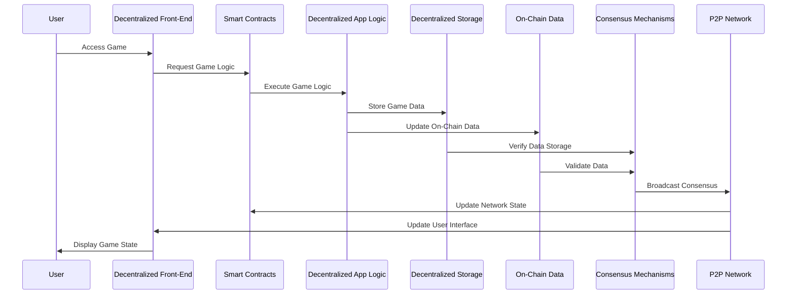
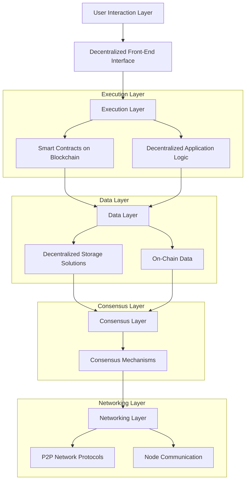
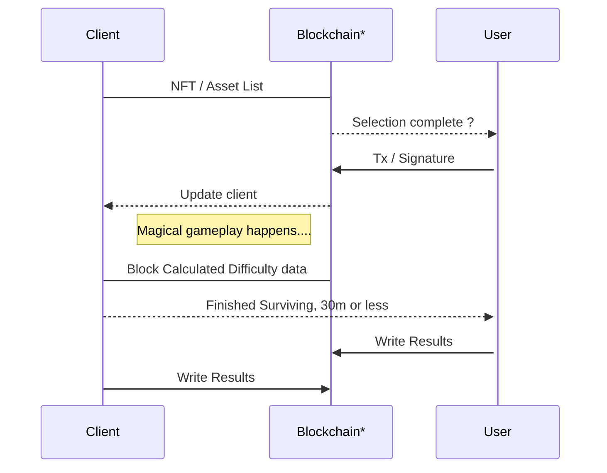
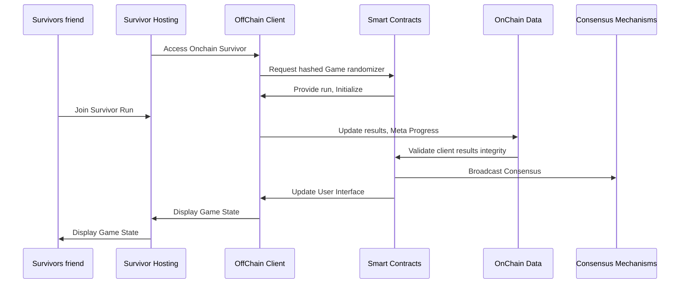

# Buried Ideas
This unordered list includes ideas scrapped during design or production. They are documented here to keep track of them and serve as a reference in case they are needed in the future. 

## 

## Onchain Execution, Ideal design of Onchain Survivor, fully descentralized vertical stack, Initial basic design 
The ideal final arquitectural design concept of executing the game entirely on-chain was scrapped. Instead, a new design was implemented where cryptographic proof ensures that the game client has not been tampered with. This approach maintains the integrity and security of the game while reducing the complexity and cost associated with full on-chain execution.

*Blockchain / RPC

## Generic NFT Traits and Properties
This document contains generic design elements that were initially drafted for the game. During production, these ideas were deemed too generic and were subsequently replaced with a more specific, onchain survivor class-oriented design.

1. Backgrounds

* Cyber City
* Neon Desert
* Digital Jungle
* Quantum Abyss
* Metaverse Market

2. Characters

* Hacker
* Cyber Samurai
* Space Ranger
* AI Entity
* Bio-enhanced Survivor

3. Outfits

* Stealth Suit
* Battle Armor
* Casual Wear
* Sci-Fi Robes
* Space Suit

4. Weapons

* Laser Sword
* Plasma Rifle
* Quantum Blaster
* Holo-Bow
* Energy Shield

5. Accessories

* Holo-Goggles
* Robotic Arm
* Jetpack
* Data Pad
* Crypto Amulet

6. Power-ups

* Speed Boost
* Shield Generator
* Healing Nanobots
* Invisibility Cloak
* EMP Grenade

7. Expressions

* Determined
* Angry
* Smirking
* Focused
* Battle-Ready

## Old Table of Contents🧩
Old table of contents used in the initial tests. 

1. [Onchain Survivor](#onchain-survivor)
2. [About the Project](#about-the-project)
   - [Key Features](#key-features)
3. [Onchain Survivor Dynamic Difficulty Scaling](#onchain-survivor-dynamic-difficulty-scaling)
4. [Getting Started](#getting-started)
   - [Prerequisites](#%EF%B8%8prerequisites%EF%B8%8F)
   - [Installation](#installation)
5. [How to Play](#how-to-play)
6. [Contributing](#contributing)
   - [Fork the Repository](#fork-the-repository)
   - [Create a New Branch](#create-a-new-branch)
   - [Commit Your Changes](#commit-your-changes)
   - [Push to the Branch](#push-to-the-branch)
   - [Open a Pull Request](#open-a-pull-request)
7. [License](#license)
8. [OnChain Survivor NFT Series, "The Survivors"](#-onchain-survivor-nft-series-the-survivors--)
9. [Basic Interaction Models](#-basic-interaction-models-%EF%B8%8F)
   - [Sequence Diagrams](#sequence-diagrams)
   - [Flowcharts](#flowcharts)
10. [Acknowledgments](#-acknowledgments)
11. [Contact](#-contact)