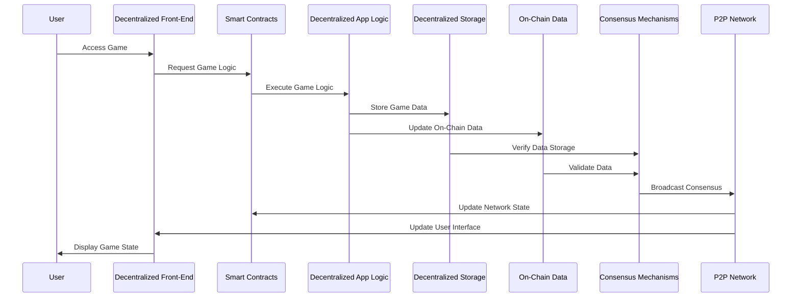
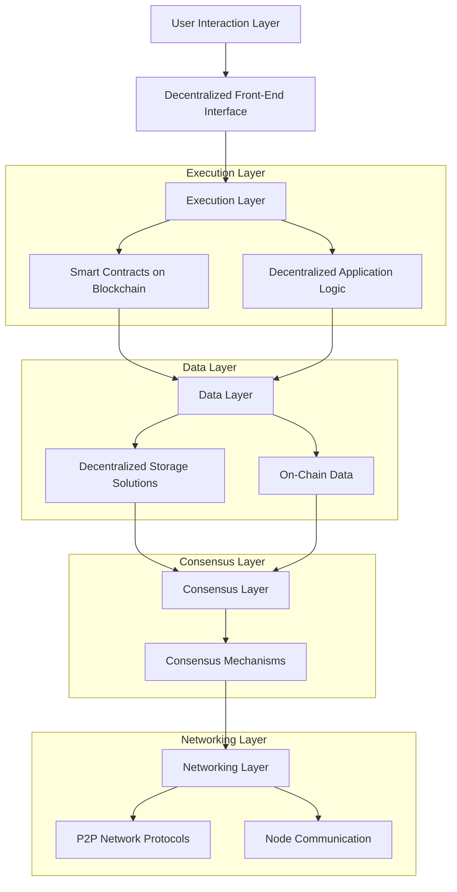
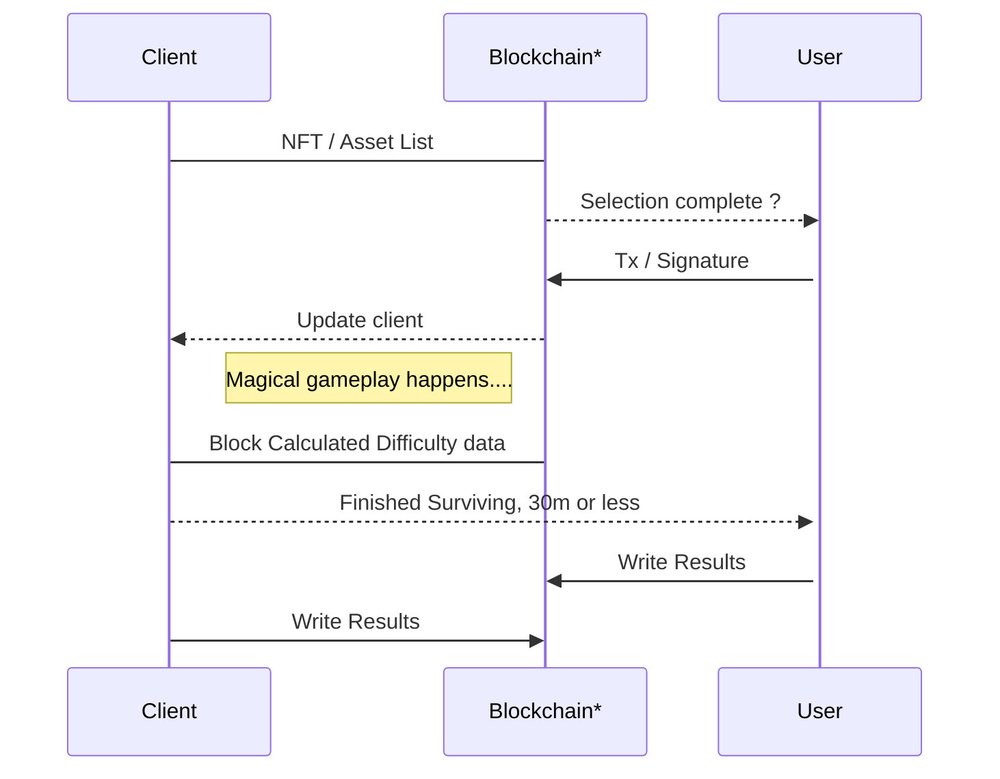
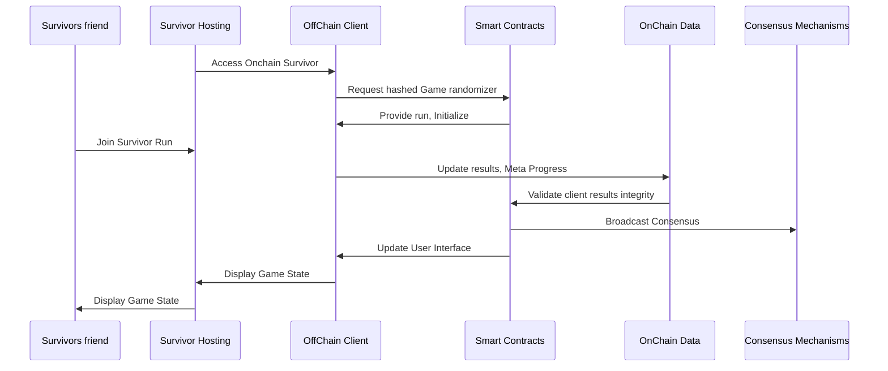
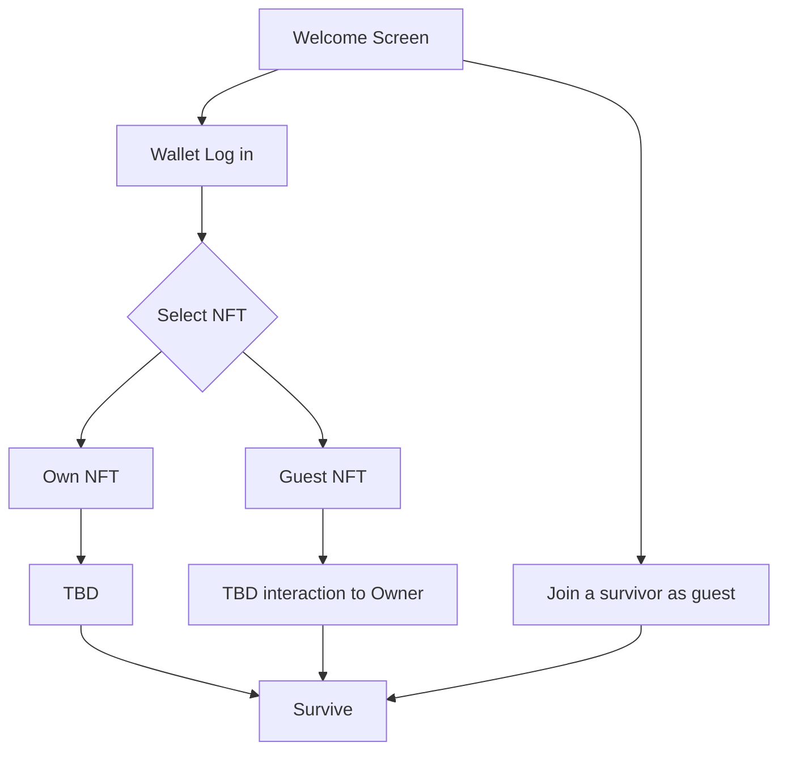

# Buried Ideas
This unordered list includes ideas scrapped during design or production. They are documented here to keep track of them and serve as a reference in case they are needed in the future. 

## Onchain Execution, Ideal design of Onchain Survivor, fully descentralized vertical stack, Initial basic design 
The ideal final arquitectural design concept of executing the game entirely on-chain was scrapped. Instead, a new design was implemented where cryptographic proof ensures that the game client has not been tampered with. This approach maintains the integrity and security of the game while reducing the complexity and cost associated with full on-chain execution.

*Blockchain / RPC

Older interacction model based on NFTs

## 🌆 OnChain Survivor NFT Series, "The Survivors"  🌆

DISCLAIMER: The Onchain Survivor NFT series will only serve as a collectible art piece. The NFT minting is neither an utility token nor a promise of equity. 
Purchasers should not expect any form of profit, profit sharing or any kind of return. 

This NFT is purely a digital collectible for fans and people who enjoy the AI Art.

|                |Own NFT                          |Guest NFT                         |
|----------------|-------------------------------|-----------------------------|
|Onchain Survivor NFT|NFT Art Featured in game.           | TBD      |
|Guest Series NFT         | TBD         | TBD             |

## Generic NFT Traits and Properties
This document contains generic design elements that were initially drafted for the game. During production, these ideas were deemed too generic and were subsequently replaced with a more specific, onchain survivor class-oriented design.

1. Backgrounds

* Cyber City
* Neon Desert
* Digital Jungle
* Quantum Abyss
* Metaverse Market

2. Characters

* Hacker
* Cyber Samurai
* Space Ranger
* AI Entity
* Bio-enhanced Survivor

3. Outfits

* Stealth Suit
* Battle Armor
* Casual Wear
* Sci-Fi Robes
* Space Suit

4. Weapons

* Laser Sword
* Plasma Rifle
* Quantum Blaster
* Holo-Bow
* Energy Shield

5. Accessories

* Holo-Goggles
* Robotic Arm
* Jetpack
* Data Pad
* Crypto Amulet

6. Power-ups

* Speed Boost
* Shield Generator
* Healing Nanobots
* Invisibility Cloak
* EMP Grenade

7. Expressions

* Determined
* Angry
* Smirking
* Focused
* Battle-Ready

## Old Table of Contents🧩
Old table of contents used in the initial tests. 

1. [Onchain Survivor](#onchain-survivor)
2. [About the Project](#about-the-project)
   - [Key Features](#key-features)
3. [Onchain Survivor Dynamic Difficulty Scaling](#onchain-survivor-dynamic-difficulty-scaling)
4. [Getting Started](#getting-started)
   - [Prerequisites](#%EF%B8%8prerequisites%EF%B8%8F)
   - [Installation](#installation)
5. [How to Play](#how-to-play)
6. [Contributing](#contributing)
   - [Fork the Repository](#fork-the-repository)
   - [Create a New Branch](#create-a-new-branch)
   - [Commit Your Changes](#commit-your-changes)
   - [Push to the Branch](#push-to-the-branch)
   - [Open a Pull Request](#open-a-pull-request)
7. [License](#license)
8. [OnChain Survivor NFT Series, "The Survivors"](#-onchain-survivor-nft-series-the-survivors--)
9. [Basic Interaction Models](#-basic-interaction-models-%EF%B8%8F)
   - [Sequence Diagrams](#sequence-diagrams)
   - [Flowcharts](#flowcharts)
10. [Acknowledgments](#-acknowledgments)
11. [Contact](#-contact)

## Enemies
Even if specific enemies were scrapped in favour of making the game survivor vs survivor oriented, these might resurface eventually as extra content. 

# Rug:
Description: A sneaky trap that appears randomly, causing the player to fall and die instantly.
Icon: A cartoon rug with a mischievous face.
Tooltip: "Avoid this pitfall! Not every rug can be trusted."

# Frontrunning Bot:
Description: Moves quickly and targets the player with precise attacks.
Icon: A sleek robot with a visor.
Tooltip: "Always one step ahead. Can you keep up?"

# Sniper Bot:
Description: Attacks from a distance with high precision.
Icon: A robot with a long-range scope and crosshair eyes.
Tooltip: "It's got you in its sights. Better keep moving!"

# MEV Bot:
Description: Manipulates the environment to create hazards for the player.
Icon: A robot with a calculator head and gears.
Tooltip: "Maximize your evasion, or get caught in its schemes!"

# Gas Cloud:
Description: Creates hazardous areas that slow and damage the player.
Icon: A green, smoky cloud with toxic symbols.
Tooltip: "Gas fees aren't the only thing that'll slow you down."

# Node Failure:
Description: Causes environmental disruptions, creating obstacles and damaging zones.
Icon: A flashing red node with warning signs.
Tooltip: "Network issues ahead! Dodge the disruptions."

# Maps

## Shitcoin Trenches 🌾
A chaotic marketplace where traders buy and sell volatile assets. Expect rapid changes and unpredictable hazards.

## The Citadel 🏰
A secure and fortified area where only the elite survive. High walls and strong defenses protect against waves of enemies.

## Underwater Trade City 🌊
A bustling underwater metropolis where commerce thrives. Navigate through underwater tunnels and avoid lurking dangers.

## Mining Caverns ⛏️
Dark, deep tunnels filled with valuable resources and dangerous enemies. Keep an eye out for falling rocks and hidden traps.

## DeFi Jungle 🌴
A dense and overgrown jungle where decentralized finance rules. Maneuver through thick foliage and evade lurking predators.

## Rug Pull Swamp 🪤
A treacherous swamp full of hidden traps. One wrong step can lead to instant doom as the ground disappears beneath you.

## Gas Fee Desert 🌵
A vast, arid desert where movement is slowed by high gas fees. Plan your path carefully to avoid getting stranded.

## Node Network Hub 🌐
A bustling hub of activity where nodes connect. Navigate through a maze of connections and defend against network attacks.

## Governance Hall 🏛️
A grand hall where decisions are made. Influence the battlefield by participating in governance votes and passing upgrades.

## Quantum Data Stream 🔍
A futuristic, digital landscape where data flows freely. Use the streams to your advantage and avoid being caught in the current.

## Bot Marketplace 🤖
A busy market where trading bots roam. Outwit the bots and use their strategies to your advantage.

## Hacker's Hideout 💻
A shadowy, secret location where hackers plot. Avoid traps and counter their attacks with your own skills.

## Decentralized Village 🏡
A quaint village where decentralization is the norm. Work together with allies and fend off waves of enemies.

## Smart Contract Plaza 📜
A bustling plaza where smart contracts are created. Use the contracts to summon allies and enhance your abilities.

## Validator's Fortress 🏯
A stronghold where validators maintain the blockchain. Defend the fortress and ensure the network's security against relentless attacks.

# Special Events

## The Trenches 🪖
**Description**: The trenches are where traders are desperate and want to exit. Enemies enter a frenzy mode, becoming faster and more aggressive for a short period.

## Matrix Attack ⊹
**Description**: Full-on world vs trader. Dodging incoming attacks becomes crucial as enemies launch a coordinated assault. Media-oriented. The metric is stacking crypto during bear markets usually.

# Passive Skills

## Trader Class
1. **Market Savvy**: Enhanced trading skills and instincts.
2. **Portfolio Diversifier**: Ability to manage diverse asset portfolios.
3. **Chart Master**: Superior technical analysis capabilities.
4. **Flash Trader**: Rapid execution of high-frequency trades.
5. **Liquidity Provider**: Expertise in supplying liquidity to various pools.
6. **Risk Manager**: Advanced risk assessment and mitigation techniques.
7. **Market Manipulator**: Influence market trends and prices.
8. **Arbitrage Specialist**: Skill in exploiting price differences across markets.
9. **Trade Whisperer**: Insider knowledge and market foresight.
10. **Panic Seller**: Ability to capitalize on market panic situations.

## Insider Cabal Class
1. **Secret Network**: Access to exclusive insider information.
2. **Market Puppeteer**: Manipulate market movements covertly.
3. **Cloak of Invisibility**: Operate undetected by regulatory bodies.
4. **Whistleblower Protector**: Shield insiders from exposure.
5. **Dark Pool Access**: Trade in private, high-volume markets.
6. **Regulatory Evader**: Bypass regulatory constraints.
7. **Corporate Spy**: Gather critical corporate secrets.
8. **Boardroom Insider**: Influence high-level corporate decisions.
9. **News Manipulator**: Control and distribute market-moving news.
10. **Stockpile Strategist**: Accumulate assets stealthily.

## Influencer Class
1. **Social Media Maven**: Command vast online followings.
2. **Trendsetter**: Initiate and lead market trends.
3. **Content Creator**: Produce impactful market analysis and insights.
4. **Viral Marketing**: Spread market sentiment rapidly.
5. **Public Speaker**: Influence large audiences through speeches.
6. **Endorsement Power**: Boost asset values through endorsements.
7. **Community Builder**: Create strong, loyal communities.
8. **Sentiment Shaper**: Mold public sentiment towards assets.
9. **FOMO Generator**: Instill fear of missing out in the market.
10. **Hype Master**: Amplify market enthusiasm.

## Developer Class
1. **Code Guru**: Superior coding and development skills.
2. **Bug Fixer**: Quick identification and resolution of software bugs.
3. **Protocol Enhancer**: Ability to improve blockchain protocols.
4. **Scalability Expert**: Develop solutions for network scalability.
5. **Smart Contract Coder**: Mastery in writing smart contracts.
6. **Patch Deployer**: Efficient deployment of software patches.
7. **Code Auditor**: Thorough and accurate code review skills.
8. **Open Source Champion**: Advocate for and contribute to open-source projects.
9. **Security Coder**: Implement high-security coding practices.
10. **Network Upgrader**: Lead and manage network upgrade processes.

## Node Operator Class
1. **Network Guardian**: Ensure the security and stability of nodes.
2. **Node Fortifier**: Strengthen nodes against attacks.
3. **Uptime King**: Maintain maximum node uptime.
4. **Latency Reducer**: Optimize node performance for low latency.
5. **Protocol Enforcer**: Implement and enforce protocol rules.
6. **Decentralization Advocate**: Promote network decentralization.
7. **Maintenance Expert**: Perform regular and effective node maintenance.
8. **Validator Supporter**: Assist validators in maintaining consensus.
9. **Energy Manager**: Efficiently manage node energy consumption.
10. **Network Monitor**: Continuously monitor network health and performance.

## Auditor Class
1. **Compliance Checker**: Ensure adherence to regulatory standards.
2. **Security Auditor**: Conduct thorough security audits.
3. **Code Reviewer**: Perform detailed code reviews.
4. **Risk Assessor**: Evaluate and mitigate potential risks.
5. **Fraud Detector**: Identify and report fraudulent activities.
6. **Financial Forensic Analyst**: Investigate financial anomalies.
7. **Policy Enforcer**: Ensure compliance with governance policies.
8. **Transparency Advocate**: Promote transparency and accountability.
9. **Whistleblower Ally**: Support and protect whistleblowers.
10. **Ethics Enforcer**: Uphold ethical standards in operations.

## Validator Class
1. **Consensus Keeper**: Maintain network consensus mechanisms.
2. **Block Producer**: Efficiently produce and validate blocks.
3. **Stake Holder**: Manage and optimize staking operations.
4. **Slashing Protector**: Minimize slashing risks.
5. **Uptime Maintainer**: Ensure high validator uptime.
6. **Validator Fortifier**: Strengthen validator security.
7. **Delegator Manager**: Handle delegations effectively.
8. **Reward Maximizer**: Optimize validator rewards.
9. **Governance Voter**: Participate actively in governance voting.
10. **Network Stabilizer**: Contribute to network stability and reliability.

## DeFi Specialist Class
1. **Yield Farmer**: Maximize returns from yield farming.
2. **Liquidity Provider**: Supply and manage liquidity in pools.
3. **Flash Loan Master**: Expertly utilize flash loans.
4. **Protocol Optimizer**: Enhance DeFi protocol efficiency.
5. **Arbitrage Specialist**: Exploit price discrepancies in DeFi.
6. **Smart Contract Auditor**: Audit DeFi smart contracts for security.
7. **Collateral Manager**: Efficiently manage collateral in DeFi platforms.
8. **Risk Mitigator**: Identify and mitigate DeFi risks.
9. **Stablecoin Expert**: Develop and manage stablecoin strategies.
10. **DeFi Strategist**: Create and implement effective DeFi strategies.

## HODLer Class
1. **Diamond Hands**: Hold assets through market volatility.
2. **Long-Term Visionary**: Focus on long-term investment strategies.
3. **Market Patience**: Exhibit patience in market fluctuations.
4. **Portfolio Stabilizer**: Maintain a stable and balanced portfolio.
5. **Conviction Holder**: Strong belief in asset potential.
6. **Volatility Resilient**: Resist panic selling during market dips.
7. **Cost Averager**: Regularly invest to average out costs.
8. **Crypto Believer**: Deep faith in the future of cryptocurrency.
9. **Maximalist**: Hold maximum positions in favored assets.
10. **Asset Accumulator**: Continuously accumulate more assets.

## Security Specialist Class
1. **Cyber Defender**: Protect against cyber threats and attacks.
2. **Penetration Tester**: Conduct thorough penetration testing.
3. **Encryption Expert**: Implement advanced encryption techniques.
4. **Vulnerability Assessor**: Identify and address system vulnerabilities.
5. **Incident Responder**: Quickly respond to security incidents.
6. **Security Auditor**: Conduct detailed security audits.
7. **Threat Analyst**: Analyze and mitigate potential threats.
8. **Access Control Manager**: Manage access controls effectively.
9. **Compliance Enforcer**: Ensure compliance with security regulations.
10. **Network Fortifier**: Strengthen network defenses.

## Miner Class
1. **Hashrate King**: Superior mining power and efficiency.
2. **Block Finder**: Increase probability of finding new blocks.
3. **Mining Pool Leader**: Manage and optimize mining pools.
4. **Energy Saver**: Efficiently manage energy consumption.
5. **Hardware Upgrader**: Continuously upgrade mining hardware.
6. **Difficulty Adjuster**: Adapt to changing mining difficulties.
7. **Reward Maximizer**: Optimize mining rewards.
8. **Security Miner**: Ensure secure mining operations.
9. **Decentralization Advocate**: Promote decentralized mining.
10. **Network Contributor**: Support the stability and security of the network.

## Whale Class
1. **Market Mover**: Influence market trends and prices.
2. **Liquidity Giant**: Provide substantial liquidity to markets.
3. **Asset Accumulator**: Hold large quantities of assets.
4. **Buy Wall Builder**: Create strong buy walls to stabilize prices.
5. **Sell Wall Constructor**: Establish sell walls to control price surges.
6. **Market Stabilizer**: Act to stabilize volatile markets.
7. **Hidden Hand**: Operate discreetly to manipulate markets.
8. **Panic Preventer**: Act to prevent market panics.
9. **Institutional Power**: Utilize significant capital for market influence.
10. **Strategic Investor**: Implement long-term, strategic investments.

## NFT Creator Class
1. **Artistic Genius**: Create highly sought-after digital art.
2. **Token Master**: Mint and manage NFT tokens efficiently.
3. **Community Builder**: Foster strong communities around NFT projects.
4. **Rarity Designer**: Design NFTs with unique and rare attributes.
5. **Market Influencer**: Influence NFT market trends.
6. **Drop Strategist**: Plan and execute successful NFT drops.
7. **Collaboration Expert**: Partner with other creators for unique projects.
8. **Brand Developer**: Build and maintain a strong personal brand.
9. **Utility Innovator**: Develop NFTs with practical uses and benefits.
10. **Metadata Maestro**: Manage detailed and accurate NFT metadata.

# NFT Traits

## Trader Class NFT Traits
1. **Suit and Tie**: Classic professional attire.
2. **Chart Goggles**: Special glasses for analyzing market trends.
3. **Briefcase of Assets**: A briefcase full of financial documents and assets.
4. **Gold Watch**: A symbol of wealth and success.
5. **Trading Terminal**: Portable device for on-the-go trading.
6. **Market News Tablet**: Always connected to the latest market news.
7. **Investment Journal**: A notebook full of trading strategies.
8. **Headset**: For constant communication with brokers.
9. **Portfolio Binder**: Detailed records of asset holdings.
10. **Power Tie**: A bold, statement-making tie.

## Insider Cabal Class NFT Traits
1. **Hooded Cloak**: Mysterious and concealing.
2. **Encrypted Phone**: For secure communications.
3. **Secret Documents**: Classified information.
4. **Cabal Ring**: Signet ring indicating membership.
5. **Anonymous Mask**: For hidden identity.
6. **Shadowy Figure**: Blending into the background.
7. **Unmarked Car**: Discreet and inconspicuous vehicle.
8. **Private Meeting Room**: Location for covert discussions.
9. **Black Suitcase**: Containing undisclosed items.
10. **Encrypted Laptop**: For confidential data storage.

## Influencer Class NFT Traits
1. **Designer Outfit**: Trendy and stylish clothing.
2. **Vlogging Camera**: Essential for creating content.
3. **Social Media Badge**: Icons of popular social media platforms.
4. **Selfie Stick**: For capturing moments on the go.
5. **Influencer Hat**: A trendy, recognizable hat.
6. **Fan Merchandise**: Branded products for fans.
7. **Microphone**: For podcasting and public speaking.
8. **Luxury Sunglasses**: Stylish eyewear.
9. **Digital Planner**: For managing content schedules.
10. **Influencer Trophy**: Award for online impact.

## Developer Class NFT Traits
1. **Laptop with Code**: Displaying lines of code.
2. **Hacker Hoodie**: Classic developer attire.
3. **Debugging Tool**: Essential for troubleshooting.
4. **Code Stickers**: On laptop and gear.
5. **VR Headset**: For exploring virtual environments.
6. **Tech Conference Badge**: Proof of attendance.
7. **Gamer Chair**: For maximum comfort during coding.
8. **Blueprints**: Plans for new projects.
9. **Tech Mug**: Filled with coffee or energy drink.
10. **Code Snippet Tattoos**: Temporary tattoos of code snippets.

## Node Operator Class NFT Traits
1. **Server Rack**: Essential for node operations.
2. **Maintenance Toolkit**: For node repairs.
3. **Network Cables**: Vital for connectivity.
4. **Monitoring Dashboard**: Displaying network health.
5. **Power Backup Unit**: Ensuring uninterrupted operations.
6. **Data Center Badge**: Access to secure locations.
7. **Node Operator Cap**: Branded hat.
8. **Security Camera Feed**: Monitoring for security.
9. **Latency Monitor**: For checking network delays.
10. **Cooling System**: Keeping servers cool.

## Auditor Class NFT Traits
1. **Clipboard with Checklists**: Essential for audits.
2. **Magnifying Glass**: Symbol of thorough examination.
3. **Audit Badge**: Proof of authority.
4. **Regulation Handbook**: Guidelines and rules.
5. **Security Clearance Card**: Access to restricted areas.
6. **Financial Reports**: Documents for review.
7. **Inspection Gloves**: For handling sensitive materials.
8. **Confidential Stamp**: Marking important documents.
9. **Audit Journal**: Detailed notes and findings.
10. **Surveillance Camera**: Monitoring for compliance.

## Validator Class NFT Traits
1. **Validation Stamp**: Symbol of approval.
2. **Blockchain Node**: Essential for network validation.
3. **Consensus Badge**: Indicating consensus participation.
4. **Stake Ledger**: Record of staked assets.
5. **Validator Helmet**: Protective gear.
6. **Network Uptime Monitor**: Tracking uptime.
7. **Delegation Book**: Managing delegations.
8. **Security Protocol Manual**: Guidelines for security.
9. **Validation Toolkit**: Tools for validation tasks.
10. **Reward Chest**: Symbolizing earned rewards.

## DeFi Specialist Class NFT Traits
1. **Yield Farming Hoe**: Symbol of yield farming.
2. **Liquidity Pool Floats**: Representing liquidity provision.
3. **Flash Loan Briefcase**: Tools for executing flash loans.
4. **DeFi Protocol Badge**: Indicating protocol knowledge.
5. **Smart Contract Scroll**: Representing smart contracts.
6. **DeFi Chart**: Tracking DeFi metrics.
7. **Risk Assessment Sheet**: Evaluating risks.
8. **Collateral Vault Key**: Managing collateral.
9. **Stablecoin Wallet**: Handling stablecoins.
10. **DeFi Strategy Book**: Documenting strategies.

## HODLer Class NFT Traits
1. **Diamond Hands Gloves**: Symbol of holding assets.
2. **Long-Term Vision Goggles**: For seeing the future.
3. **Patience Medal**: Award for enduring market cycles.
4. **Stability Ledger**: Record of stable holdings.
5. **Conviction Pendant**: Symbol of strong belief.
6. **Volatility Shield**: Protecting against market swings.
7. **Cost Averaging Calculator**: Tool for averaging costs.
8. **Crypto Faith Badge**: Indicating faith in crypto.
9. **Maximalist Banner**: Representing maximalist beliefs.
10. **Asset Accumulation Bag**: For gathering assets.

## Security Specialist Class NFT Traits
1. **Firewall Shield**: Protection against threats.
2. **Penetration Testing Kit**: Tools for testing security.
3. **Encryption Key**: Symbol of secure data.
4. **Vulnerability Scanner**: Detecting weaknesses.
5. **Incident Response Badge**: For rapid response.
6. **Security Audit Report**: Documenting audits.
7. **Threat Analysis Tablet**: Analyzing threats.
8. **Access Control Card**: Managing access.
9. **Compliance Certificate**: Ensuring compliance.
10. **Network Defense Helmet**: For network protection.

## Miner Class NFT Traits
1. **Mining Pickaxe**: Classic tool for mining.
2. **Mining Helmet**: With a bright headlamp.
3. **Dusty Overalls**: Work attire for the mines.
4. **Crypto Ore**: A chunk of valuable digital minerals.
5. **Heavy-Duty Gloves**: For handling equipment.
6. **Mining Rig**: Essential for cryptocurrency mining.
7. **Cooling Fan**: To keep mining rigs from overheating.
8. **Energy Drink**: To stay alert during long mining sessions.
9. **Mining Goggles**: Protecting eyes from debris.
10. **Electricity Bill**: A high bill from extensive mining.

## Whale Class NFT Traits
1. **Gold-Plated Wallet**: Signifying wealth.
2. **Luxury Yacht**: Symbol of opulence.
3. **Whale Icon**: A stylized whale.
4. **Expensive Watch**: High-end timepiece.
5. **Diamond Cufflinks**: Lavish accessories.
6. **Private Jet**: Exclusive travel mode.
7. **Executive Suit**: Tailored for success.
8. **VIP Pass**: Access to exclusive events.
9. **Investment Portfolio**: Diverse and extensive.
10. **Gold Bars**: Literal representation of wealth.

## Community Leader Class NFT Traits
1. **Community Badge**: Symbol of leadership.
2. **Town Hall Mic**: For addressing the community.
3. **Organizer Clipboard**: For planning events.
4. **Welcome Banner**: Greeting new members.
5. **Feedback Form**: Collecting community input.
6. **Event Planner**: Scheduling community activities.
7. **Community Shield**: Protecting the group.
8. **Engagement Trophy**: For high engagement.
9. **Support Ribbon**: Signifying solidarity.
10. **Volunteer Medal**: Recognizing contributions.

## Arbitrageur Class NFT Traits
1. **Market Scanner**: For identifying opportunities.
2. **Profit Calculator**: Essential for calculations.
3. **Exchange Ticket**: Representing multiple exchanges.
4. **Arbitrage Badge**: Indicating expertise.
5. **Fast Execution Shoes**: Symbolizing quick actions.
6. **Balance Ledger**: Tracking multiple accounts.
7. **Strategy Notebook**: Detailed arbitrage plans.
8. **Arbitrage Bot**: Automated trading bot.
9. **High-Speed Internet**: For faster transactions.
10. **Cross-Exchange Monitor**: Keeping an eye on markets.

# Game modes

**Blockchain mode**: All random classes and abilities, no pause option, 100% seamless play, destroy all bosses. 

**Survivor mode**: Level up, choose your ability path between 3 skills each time . Survive  a fixed time to 30 minutes 30 minutes. 

**Professional mode**: Select a class, each class has a predefined set of abilities , beat the final boss of each class.