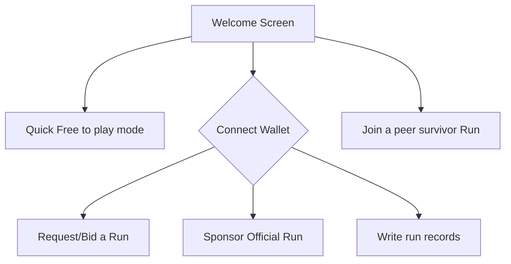
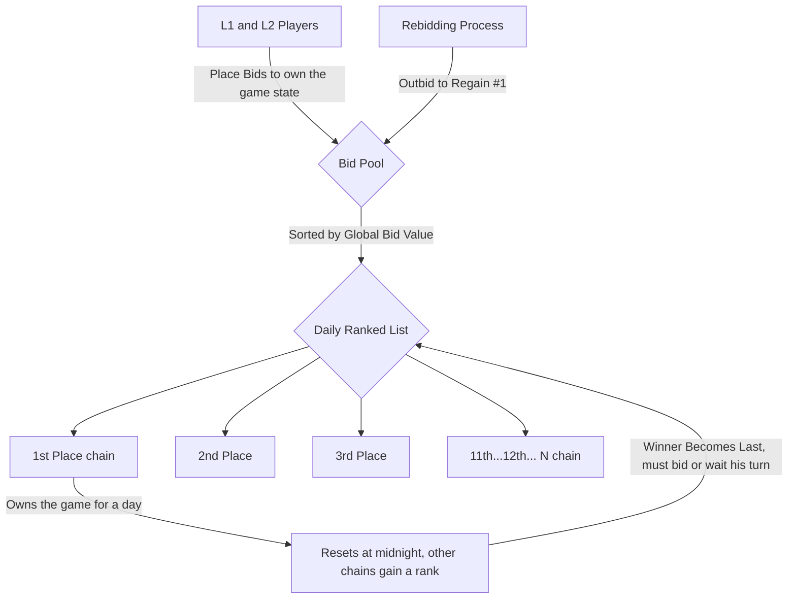
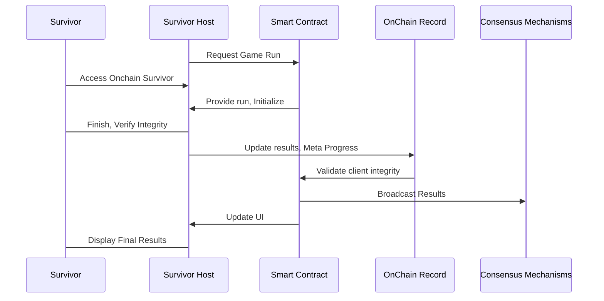

# Congratulations, 🔗 Survivor 🏆 !

Survivor! Congratulations on making it this far, You survived every hack, every rug, every fork and every twist in the crypto journey. 🚀💪 Keep pushing forward! 🌟🔥

## Onchain Survivor🔗🏆

Welcome to **OnChain Survivor** Official Repository ! 🌐🎮 The usage of AI in the development of this game is not just encouraged but considered mandatory. Fun, simplicity, decentralization, and openness are the foundational pillars of the project.

## 🌟About the Project🌟

Onchain Survivor is a web-based top-down survival game that utilizes Web3 technologies to enable open source, decentralized and consensus to the experience. Navigate a 3D Blockchained environment to do what they do best... Survive!

## Game Overview 🎮

**Title**: Onchain Survivor  
**Genre**: Top-Down Arena Shooter, Survival Roguelite
**Platform**: Web
**Technology**: Web3, Blockchain Integration
**Objective**: Complete challenges in an arena, defeating enemies, leveling up, and upgrading abilities.

Onchain Survivor aims to combine the addictive gameplay of survival roguelite games with the innovative potential of blockchain technology and machine learning, creating a unique and engaging experience for players. With a variety of classes, enemies, power-ups, and upgrades, players will enjoy a dynamic and challenging survival experience set within the exciting world of blockchain.

### 🔑Key Features🔑

- **Decentralized Gameplay**: Enjoy a truly consensus based, decentralized experience. No central server required. No log ins. No external dependencies beyond your connection with he blockchain. You can keep a copy of the client and fire it up!. 
- **Blockchain Integration**: Interact with the dynamic blockchain technology and data, The game uses block data to generate the difficulty. And the strong playerbase consensus sets the game experience on a daily basis.   
- **3D Graphics**: Experience 3D graphics powered by Three.js, in any browser.
- **Cross-Platform**: Survive directly Either desktop or mobile, without the need for additional hardware. Simple is best. You can even play from your wallet!
- **Variable Gameplay**: Every experience is different on a daily basis, yet all players taking the challenge keep in sync.
- **Leveling Up**: Defeating enemies grants experience points (XP). Upon leveling up, players can choose from various abilities.
- **Power-Ups**: Enemies may drop power-ups, experience, and abilities. Very low chances.

## Art Style 🎨

**Top-Down View**: 3D Low poly style, for phase 1. 
**Color Palette**: Bright and vibrant neon colors to distinguish different elements and enemies and the vibrant backgrounds.
**Animation**: AI powered animations for characters, enemies, and effects.

## Sound Design 🎵

**Background Music**: Upbeat, electronic AI made music to match the fast-paced gameplay.
**Sound Effects**: Distinct sounds for enemy attacks, power-ups, and level-ups.
**Voiceovers**: Occasional voice lines for level-ups, power-up pickups, and mini-events.

## Blockchain Integration 🔗

**Record Holding**: The blockchain will serve the challenges so players can have their records stored forever.
**Challenges**: For holding player challengers consensus over the daily state of the game.
**Real Time Difficulty Setting**: Depending on several  factors related to the blocklchain state!

## Development Roadmap 🛠️

Not a roadmap per se, but More or less a loose list of the current development cycle, as certain items are all being executing in parallel in real time.

**Prototype Development**: Basic mechanics, character movement, and enemy AI.
**Core Mechanics**: Implement leveling up, power-ups, and upgrades.
**UI Design**: Develop and integrate the UI elements.
**Blockchain Integration**: Integrate Web3 technologies for decentralized interactions.
**Art and Sound Design**: Develop and integrate art assets and sound effects.
**Testing**: Conduct playtesting and debugging.
**Launch**: Deploy the game on the web platform.
**Constant Content Updates**: Regular updates with new content, events, and features.

## Icons 🖼️

- **Upgrades:** AI generated icons representing different upgrade types (e.g., a footprint for Onchain Trail).
- **Power-Ups:** 3D models in the arena representing different power-ups (e.g., a hatch on the floor for the Exit hatch Ability).

## Arena Design 🏟️
- **Theme:** Blockchain-themed elements (e.g., nodes, blocks, chains). at the beggining. as the game evolves and partnerships form, this might change. 
- **Obstacles:** Various blockchain-related obstacles (e.g., smart contracts, consensus mechanisms) and enemies.
- **Environmental Hazards:** Dynamic elements such as gas clouds, electric fields, fog of war, and node failures that add challenges.

## Marketing Strategy 📈
Product is still in development, but as it gains more shape, there are many plans to expand the playerbase!
- **Peer to Peer, Word of mouth**: The best of the best method to gain users. a fun game that everyone wants to play with friends. 
- **Community Engagement:** Leverage blockchain and their communities for promotion.
- **Social Media:** Utilize social media platforms to share updates and engage with players.
- **Partnerships:** Collaborate with blockchain projects and influencers for cross-promotion.
- **Content Creators:** Engage streamers and content creators to showcase gameplay and mechanics.
- **Events:** Host in-game events and challenges with other Communities.

### 🥇 Phase 1 🥇: Daily Game Challenges, by challengers for players!

This  system integrates both L1 (Ethereum) and L2 blockchains, allowing users from these networks to add their challenges to the Challenge queue. The  system is competitive, with each user placing their challenges, aiming for the top positions on the leaderboard. The structure is dynamic and ONLY the number one in the queue becomes the main challenger for the next day!. The initial plan is to have the challenge queue settle on ethereum until several Usex Experience issues are solved, but this can change in the future to move to a L2.

Queue Process

**Setting Challenge**: Users from Ethereum (L1) and various L2 blockchains submit challenges into the global queue. The challenge values determine the ranking, where the highest one of the day secures the first position and the game state, while the second-highest becomes the next in line, and so on until all ranks are fille,  ensuring opportunities for all participants.

**Daily Rank up**: At midnight, the top-ranked challenge in the queue becomes the game state for the set period of time, making room for the second-highest to claim the number one spot. All other positions advance one spot too!

**Adding**: If the previous day's top-ranked in the Challenge Queue wants to secure the first rank again, they must re add with a higher amount to reclaim their position and set the game Challenge for consecutive days.

This system ensures fairness by regularly refreshing the queue, preventing any one user from monopolizing the top position.

### Phase 2: Multiple games, all using the same Challenge Queue and Human Consensus.
### Phase 3: AI generated real time experiences, using Human Consensus, Overlayed on top of the template games. 

## 😈👺Onchain Survivor Dynamic Difficulty Scaling👺😈

The *Onchain Survivor Dynamic Difficulty Scaling  function* will be satisfying gameplay up until minute 30. We'll assume the difficulty increases exponentially until the end. Depending on several accounting factors related to both the Players $P$ and the blockchain $B$. Let  $D(t)$  be the difficulty at time  $t$.   The final difficulty can be modeled as:

$D(t) = D_0 e^{kt} +α(Pavg​−P(t)+βB(t))$

where:

-   $D0$  is the initial difficulty at  $t=0$,
-   $k$  is a constant that determines the rate of difficulty increase.
-   $α$  is a scaling factor for the performance adjustment,
-   $Pavg​$  is the average expected performance,
-   $P(t)$  is the player's performance at time  $t$.
- $β$  is a scaling factor for the blockchain-derived difficulty,
- $B(t)$  is the difficulty factor extracted from the latest blockchain block.

Note:  Random difficulty factor $B(t)$ that is extracted from the latest block in the blockchain. The factor $B(t)$ could be based on various metrics from the blockchain, such as transaction volume, block size, or other relevant activities. The term $βB(t)$ allows the difficulty to adapt dynamically based on real-time blockchain data, adding an element of unpredictability and aligning with the decentralized nature of blockchain games. 

##  📚  Interaction Models 🕹️

As frictionless and simple as possible, No wallet required to play, the game's first priority is FUN. If the game is not fun then it will not be sustainable! 

Rank based auction system with periodic reset model, giving chances for all the supported chains to be able to write into the Hall of survivors!

Final design of onchain survivor, a peer-to-peer multiplayer, trustless, descentralized  game that keeps the survivors honest cryptography! 

## 🚀Getting Started🚀 

Follow these steps to set up Onchain Survivor on your local machine:

### ⏱️Prerequisites⏱️
- Currently tests should run in 4 years old hardware. Optimization is always an ongoing process, so please be patient.

### 💿Installation💿
- Download the client release and open index.html in your local server, or visit https://onchainsurvivor.pages.dev.

A Web3 Wallet is required to participate in the ranks!

## 🎮How to Survive🎮

-   **Connect wallet, and Request a run from the Hall of survivors**
-   **OR Join a run**: Enter an address and click "Join Room" to connect with survivor currenly playing.
-   **Move Your survivor**: Use the arrow keys, on screen joystick, WASD or IJKL to move your character around the 3D environment.
-   **Upgrade, evolve, fork, Survive**: Your movements and decisions will be broadcast to your partner in real-time. Every choice affects your gameplay. Every Ability you choose is significant, so choose wisely.

## 🤝Contributing🤝

Contributions from everyone are welcomed! You can contact me directly, make a proposal directly in github. I am really focusing adding content into the game, but you can ping me on twitter to notify me about your contribution. 

1.  **Fork the Repository**
2.  **Create a New Branch**
3.  **Commit Your Changes**
4.  **Push to the Branch**
5.  **Open a Pull Request**

## 📜License📜 

This project license is currently [TBD]. 

## 🙏 Acknowledgments ❤️

-   **Three js**: For the amazing engine ❤️.
-   **Web3 js**: For simplifying blockchain interactions ❤️.
-   **OpenAI ChatGPT**: For making development great again ❤️.
-   **Microsoft Copilot**: Best Artist i've ever known ❤️.
-   **Adobe Mixamo**: Best 3D Animator ❤️.
-   **Meshy.ai**: Best 3D Modeler ever ❤️, under the https://creativecommons.org/licenses/by/4.0/ License

## 📬 Contact

Have questions? Feel free to reach out!

-   **Twitter**:  [@OnChainSurvivor](https://twitter.com/onchainsurvivor)

Thank you for visiting our repository! We hope you enjoy Onchain Survivor as much as we enjoy developing it. Happy surviving! 🌍🎮
