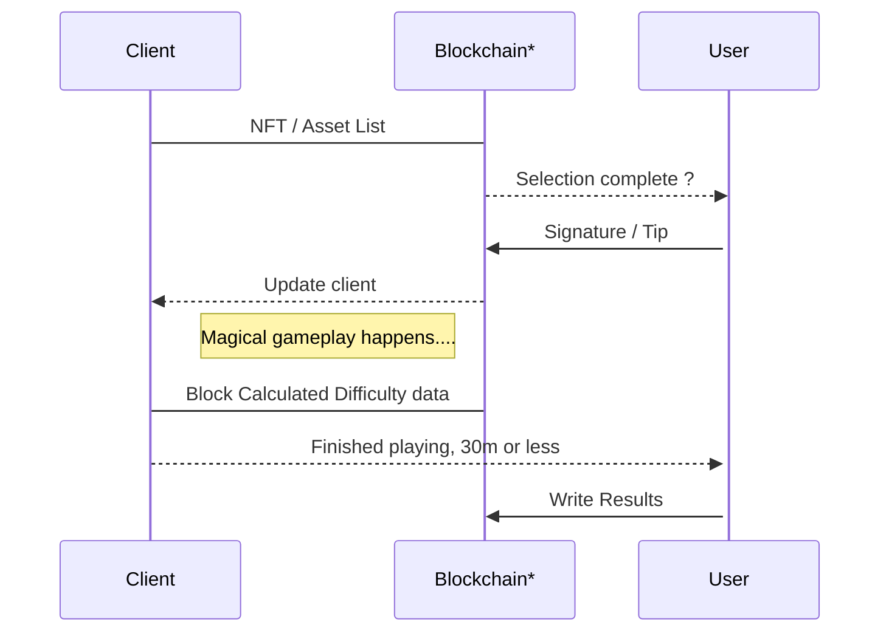
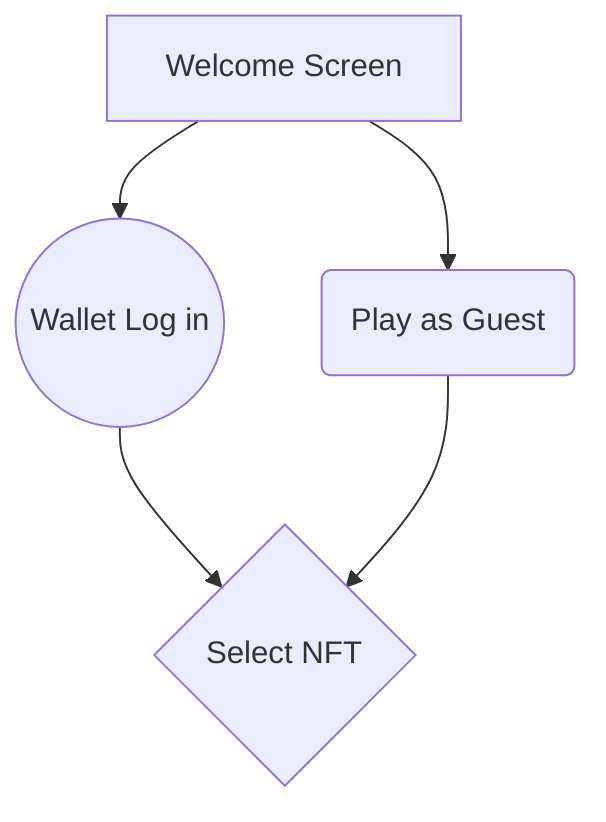

# Congratulations, Survivor!

Survivor! Congratulations on making it this far, You survived every hack, every rug, every fork and every twist in the crypto journey. 🚀💪 Keep pushing forward! 🌟🔥

# Onchain Survivor 🔗🏆

Welcome to **OnChain Survivor** Official Repository ! 🌐🎮

## 🌟 About the Project

Onchain Survivor is a web-based game that utilizes Web3 technologies to enable Open Source, decentralized, peer-to-peer multiplayer interactions. Players can navigate a 2.5D environment to do what they do best.... Survive Together! while enjoying blockchain features to enhance their gameplay experience.

### Key Features 🔑

- **Decentralized Gameplay**: Enjoy a truly decentralized multiplayer experience with peer-to-peer connections. No central server required.  You can keep a copy of the client and fire it up connecting with a friend. 
- **Blockchain Integration**: Interact with the Ethereum blockchain using Web3.js. Ethereum will hold the game data. 
- **3D Graphics**: Experience immersive 2.5D graphics powered by Three.js.
- **Cross-Platform**: Play directly in your web browser, Either desktop or mobile, without the need for additional installations. Simple is best.

## Onchain Survivor Dynamic Difficulty Scaling 👺😈

The *Onchain Survivor Dynamic Difficulty Scaling  function* will be satisfying gameplay up until minute 30. We'll assume the difficulty increases exponentially until the end. Depending on several accounting factors related to both the Players $P$ and the blockchain $B$. Let  $D(t)$  be the difficulty at time  $t$.   The final difficulty can be modeled as:

$D(t) = D_0 e^{kt} +α(Pavg​−P(t)+βB(t))$

where:

-   $D0$  is the initial difficulty at  $t=0$,
-   $k$  is a constant that determines the rate of difficulty increase.
-   $α$  is a scaling factor for the performance adjustment,
-   $Pavg​$  is the average expected performance,
-   $P(t)$  is the player's performance at time  $t$.
- $β$  is a scaling factor for the blockchain-derived difficulty,
- $B(t)$  is the difficulty factor extracted from the latest blockchain block.

Note:  Random difficulty factor $B(t)$ that is extracted from the latest block in the blockchain. The factor $B(t)$ could be based on various metrics from the blockchain, such as transaction volume, block size, or other relevant activities. The term $βB(t)$ allows the difficulty to adapt dynamically based on real-time blockchain data, adding an element of unpredictability and aligning with the decentralized nature of blockchain games. 

## 🚀 Getting Started

Follow these steps to set up Onchain Survivor on your local machine:

### Prerequisites
- TBD

### Installation
- TBD

## 🎮 How to Play

-   **Select to play as guest or with your own NFT**
-   **Join a Room**: Enter a room ID and click "Join Room" to connect with other players.
-   **Move Your Character**: Use the arrow keys to move your character around the 3D environment.
-   **Survive**: Your movements will be broadcast to the other player in real-time.

## 🤝 Contributing

We welcome contributions from everyone! Here’s how you can help:

1.  **Fork the Repository**: Click the "Fork" button at the top-right corner of this page.
2.  **Create a New Branch**:
    `git checkout -b feature/your-feature-name` 
    
3.  **Commit Your Changes**:
    `git commit -m "Add some feature"` 
    
4.  **Push to the Branch**:
    `git push origin feature/your-feature-name` 
    
5.  **Open a Pull Request**: Navigate to the original repository and click "New Pull Request".

## 📜 License

This project license is currently [TBD]. 

## 🌆 OnChain Survivor NFT  features 🌆

|                |Own NFT                          |Borrow NFT                         |
|----------------|-------------------------------|-----------------------------|
|Onchain Survivor NFT|Free Play           |Fee / TIP Play      |
|Guest Series NFT         | Fee / TIP Play         |Fee / TIP Play            |

##  📚 Basic Interaction Models 🕹️

*Blockchain / RPC

## 🙏 Acknowledgments

-   **Three js**: For the amazing 3D graphics library.
-   **Web3 js**: For simplifying blockchain interactions.

## 📬 Contact

Have questions? Feel free to reach out!

-   **Twitter**:  [@ChainSurvivor](https://twitter.com/chainsurvivor)

Thank you for visiting our repository! We hope you enjoy playing Onchain Survivor as much as we enjoy developing it. Happy surviving! 🌍🎮
