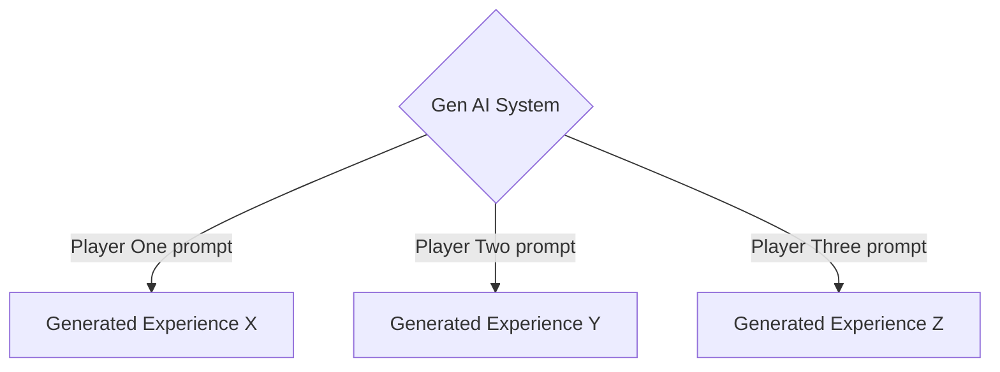
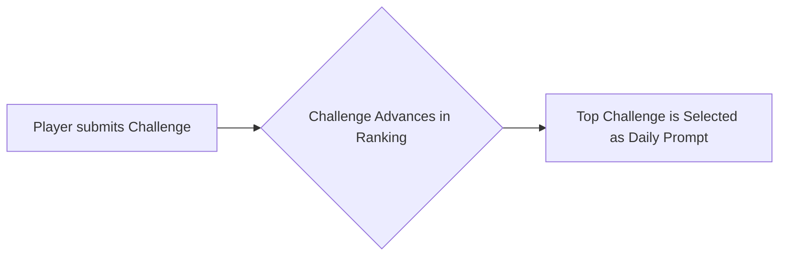
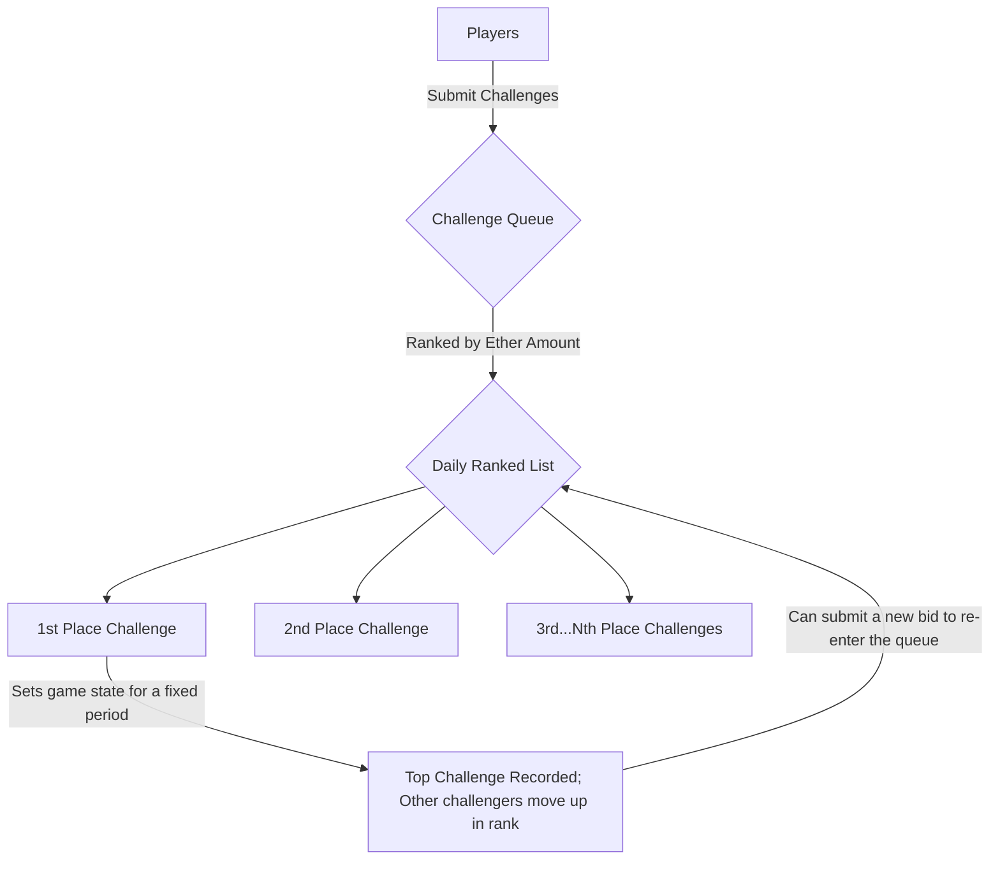
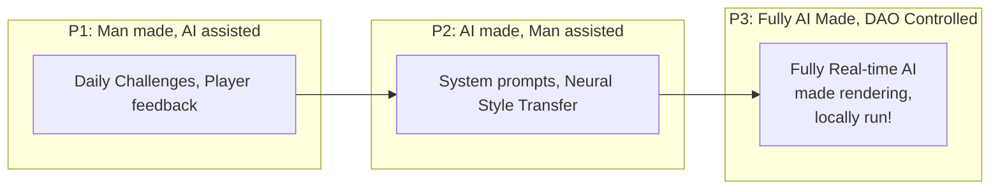
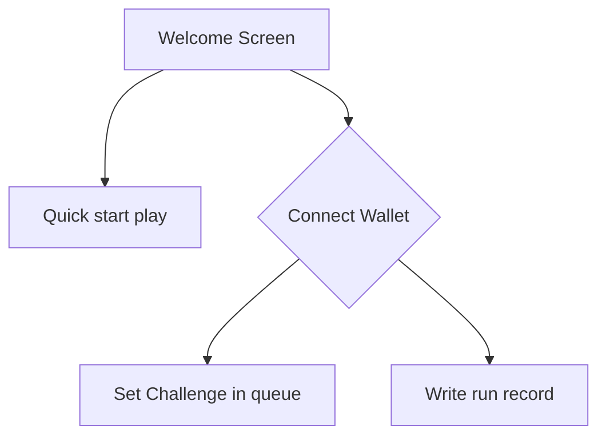
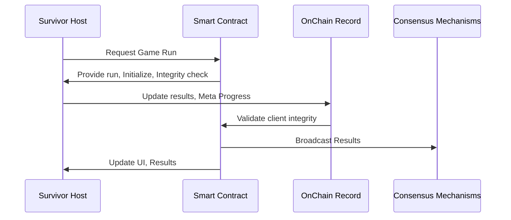

## Congratulations, Survivor!

Welcome to the Onchain Survivor repository! Our project is built on the principles of fun, simplicity, decentralization, and openness.

Onchain Survivor is a browser top-down survival game, that leverages artificial intelligence in tandem with Web3 technologies to deliver a fresh gaming experience. Players navigate dynamically generated environments where the main goal is simple: survive. We combine the potential of AI and the security of blockchains to create a unique and immersive experience.

## The daily challenge, Integrations, & Game Design

Thanks to genAI, the gaming world will change, with players being able to generate diverse gaming experiences with a single prompt. While this capability can unlock incredibly immersive virtual worlds, it also risks isolating these creations from broader communities. By incorporating blockchains as a ledger serving as a source of truth and consensus, we aim to connect and share these experiences, ensuring they become part of a larger, interactive ecosystem for many players.

OnChain Survivor employs a system where players submit challenges into a shared queue that  will  reflect and provide feedback on gameplay demands, using  Blockchain technology to record both current and past challenges, ensuring transparency and integrity. The challenge at the top of the queue becomes the gameplay prompt for a fixed period of time (measured in blocks), meaning all players engage with the same challenge and share a unified experience. This mechanism works like an auction: as challenges are submitted, they are ranked, giving every participant the opportunity to have their challenge selected as the daily prompt.

## Development Roadmap: Towards Locally Generated AI Worlds

Onchain Survivor aims to be fully local AI run experience, where game environments and content are generated in real time locally, based on consensus inputs at a global scale.

In the short term, the project will combine human creativity with AI-assisted asset production, laying the foundation for a gradual transition toward fully AI made worlds. The evolution will begin by incorporating semi-automated tools, such as neural style transfer and procedural asset generation—and will progressively integrate more advanced AI systems capable of managing gameplay dynamics, visual design, audio, and narrative concurrently. Blockchain technology will be used to record and synchronize these experiences, ensuring that all players share a consistent, verifiable narrative.

## Art & Sound
While the current version uses basic 3D graphics and simple music, future iterations will integrate neural style transfer and AI-generated music to offer diverse, evolving artistic experiences

## Interaction Models 

### Prerequisites
- Currently it should run in 4 years old hardware. Optimization is always an ongoing process, so please be patient.
- A Web3 Wallet to participate in the ranks 

## Getting Started & Installation
- Download the client and open index.html in your local server, or visit https://onchainsurvivor.pages.dev
- A Web3 Wallet is required to participate in the ranks!

## Contributing

Contributions from everyone are welcomed! You can contact me directly, make a proposal directly in github. I am really focusing adding content into the game, but you can ping me on twitter to notify me about your contribution. 

## License

[TBD]. 

## Acknowledgments ❤

-   **Three js**: engine ❤.
-   **Web3 js**: blockchain interactions ❤.
-   **OpenAI ChatGPT**: ai ❤.
-   **Microsoft Copilot**:  art ❤.
-   **Adobe Mixamo**: 3d animator ❤.
-   **Meshy.ai**: low poly 3d modeler ❤, under the https://creativecommons.org/licenses/by/4.0/ License.
-   **Tensor Flow**: neural style transfer ❤
-   **Cursor**: IDE ❤.

## Contact

 Feel free to reach out!

-   **Twitter**:  [@OnChainSurvivor](https://twitter.com/onchainsurvivor)

Thank you for visiting! I hope you enjoy Onchain Survivor as much as I enjoy developing it. Happy surviving! 

## Donations

My public addresses, in case a soul wants to make a donation! 

BTC:
bc1p5qg2972ksyk2uc29nky4kapkm9tr6nmqjes9caxgs4esdtzk0frs0ul527

ETH - Base, Arbitrum, Optimism, Linea and so on:
0xBC321C9EcBd7FC3A5867DE8db50f38AEe9011415

Solana:
8YDRKsVQxe3wmVifX39rM2qv7qqJwUaTEh7TXiu4tFg1

Dogecoin:
DJExfzzy6KacVuHHodj7FgQaRPtxnMqR2Y

Cardano Address:
addr1q9qqjsumzss320vhuqgfdmx9kc7gwxhukqf9qcmzd2cy9pytkv39w340zrmvp6erg5fyqegxt3qfvvuaeccfj98taryq0ezutk

XRP:
rJjSrrdJt6qjAsyShjnUCJ6PULUUBivRpb

Tron:
TUCo6gDtMssHmNpo9qDCAdJkT15QDFyBUh

Litecoin:
ltc1qt9zsxdur80ava2hp0y53s9l6kf63u2w0r8jc97
