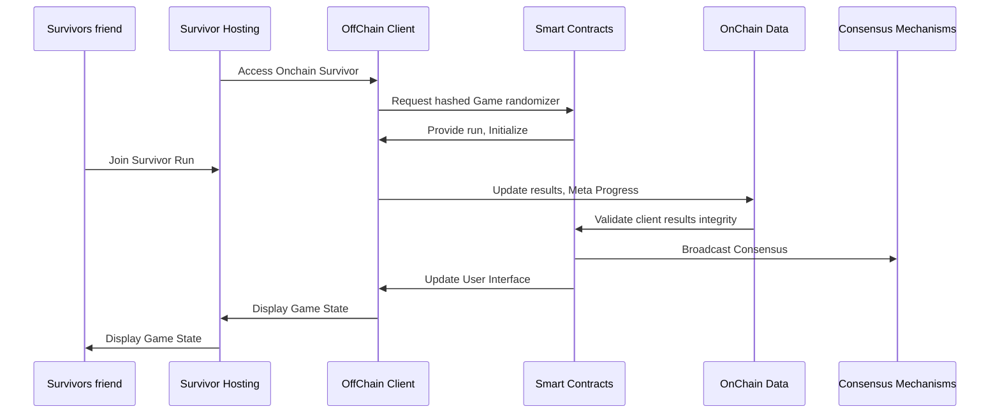

# Congratulations, 🔗 Survivor 🏆 !

Survivor! Congratulations on making it this far, You survived every hack, every rug, every fork and every twist in the crypto journey. 🚀💪 Keep pushing forward! 🌟🔥

## Onchain Survivor🔗🏆

Welcome to **OnChain Survivor** Official Repository ! 🌐🎮 The usage of AI in the development of this game is not just encouraged but considered mandatory. Fun, simplicity, decentralization, and openness are the foundational pillars of the project.

## 🌟About the Project🌟

Onchain Survivor is a web-based top-down arena shooter survival roguelite game that utilizes Web3 technologies to enable Open Source, decentralized, peer-to-peer multiSurvivor interactions. Navigate a 3D Blockchained environment to do what they do best... Survive Together!

### 🔑Key Features🔑

- **Decentralized Gameplay**: Enjoy a truly decentralized multiSurvivor experience with peer-to-peer connections. No central server required.  You can keep a copy of the client and fire it up connecting with a friend!. 
- **Blockchain Integration**: Interact with the dynamic blockchain technology and data, The game uses block data to generate the difficulty.  
- **3D Graphics**: Experience immersive 3D graphics powered by Three.js, in any browser.
- **Cross-Platform**: Survive directly Either desktop or mobile, without the need for additional hardware. Simple is best. You can even play from your wallet!
- **Variable Gameplay**: Every experience is different, Guaranteed. 

## 😈👺Onchain Survivor Dynamic Difficulty Scaling👺😈

The *Onchain Survivor Dynamic Difficulty Scaling  function* will be satisfying gameplay up until minute 30. We'll assume the difficulty increases exponentially until the end. Depending on several accounting factors related to both the Players $P$ and the blockchain $B$. Let  $D(t)$  be the difficulty at time  $t$.   The final difficulty can be modeled as:

$D(t) = D_0 e^{kt} +α(Pavg​−P(t)+βB(t))$

where:

-   $D0$  is the initial difficulty at  $t=0$,
-   $k$  is a constant that determines the rate of difficulty increase.
-   $α$  is a scaling factor for the performance adjustment,
-   $Pavg​$  is the average expected performance,
-   $P(t)$  is the player's performance at time  $t$.
- $β$  is a scaling factor for the blockchain-derived difficulty,
- $B(t)$  is the difficulty factor extracted from the latest blockchain block.

Note:  Random difficulty factor $B(t)$ that is extracted from the latest block in the blockchain. The factor $B(t)$ could be based on various metrics from the blockchain, such as transaction volume, block size, or other relevant activities. The term $βB(t)$ allows the difficulty to adapt dynamically based on real-time blockchain data, adding an element of unpredictability and aligning with the decentralized nature of blockchain games. 

## 🚀Getting Started🚀 

Follow these steps to set up Onchain Survivor on your local machine:

### ⏱️Prerequisites⏱️
- Currently tests should easily run in 10 years old hardware or less.

### 💿Installation💿
- Download the client release and open index.html in your preferred browser. 

## 🎮How to Survive🎮

-   **Select to Survive as guest or with your own NFT**
-   **Join a Room**: Enter an address and click "Join Room" to connect with other survivor.
-   **Move Your survivor**: Use the arrow keys to move your character around the 3D environment.
-   **Upgrade, evolve, fork, Survive**: Your movements and decisions will be broadcast to your partner in real-time.

## 🤝Contributing🤝

Contributions from everyone are welcomed! Here’s how you can help:

1.  **Fork the Repository**: Click the "Fork" button at the top-right corner of this page.
2.  **Create a New Branch**:
    `git checkout -b feature/your-feature-name` 
    
3.  **Commit Your Changes**:
    `git commit -m "Add some feature"` 
    
4.  **Push to the Branch**:
    `git push origin feature/your-feature-name` 
    
5.  **Open a Pull Request**: Navigate to the original repository and click "New Pull Request".

## 📜License📜 

This project license is currently [TBD]. 

## 🌆 OnChain Survivor NFT Series, "The Survivors"  🌆

DISCLAIMER: The Onchain Survivor NFT series will only serve as a collectible art piece. The NFT minting is neither an utility token nor a promise of equity. 
Purchasers should not expect any form of profit, profit sharing or any kind of return. 

This NFT is purely a digital collectible for fans and people who enjoy the AI Art.

|                |Own NFT                          |Guest NFT                         |
|----------------|-------------------------------|-----------------------------|
|Onchain Survivor NFT|NFT Art Featured in game.           | TBD      |
|Guest Series NFT         | TBD         | TBD             |

##  📚 Basic Interaction Models 🕹️

  ```mermaid
  graph TD
A[Welcome Screen] --> B[Wallet Log in]
A --> C[Survive as Guest]
B --> D{Select NFT}
D --> E[Own NFT]
D --> F[Guest NFT]
E --> G[TBD]
F --> H[TBD interaction to Owner]
G --> I[Survive]
H --> I
C --> I
```




## 🙏 Acknowledgments

-   **Three js**: For the amazing 3D graphics library.
-   **Web3 js**: For simplifying blockchain interactions.
-   **OpenAI ChatGPT**: For making development great again.
-   **Microsoft Copilot**: Best Artist i've ever known.

## 📬 Contact

Have questions? Feel free to reach out!

-   **Twitter**:  [@ChainSurvivor](https://twitter.com/chainsurvivor)

Thank you for visiting our repository! We hope you enjoy Onchain Survivor as much as we enjoy developing it. Happy surviving! 🌍🎮