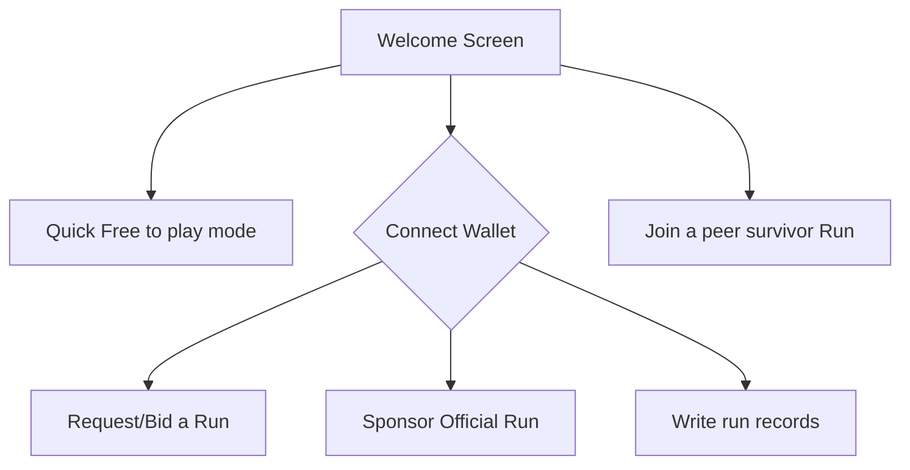
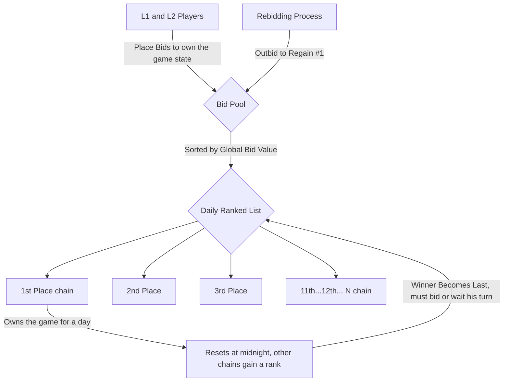
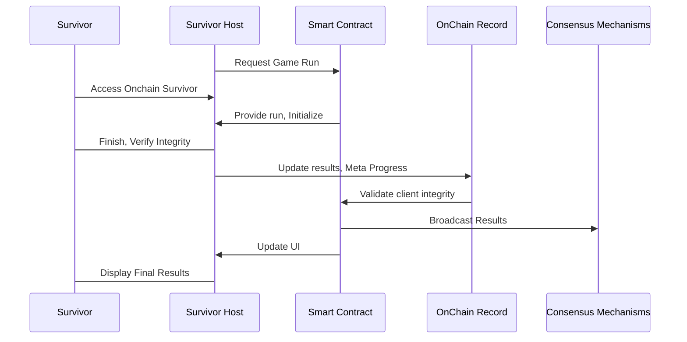

# Congratulations, 🔗 Survivor 🏆 !

Survivor! Congratulations on making it this far, You survived every hack, every rug, every fork and every twist in the crypto journey. 🚀💪 Keep pushing forward! 🌟🔥

## Onchain Survivor🔗🏆

Welcome to **OnChain Survivor** Official Repository ! 🌐🎮 The usage of AI in the development of this game is not just encouraged but considered mandatory. Fun, simplicity, decentralization, and openness are the foundational pillars of the project.

## 🌟About the Project🌟

Onchain Survivor is a web-based top-down arena shooter survival roguelite game that utilizes Web3 technologies to enable Open Source, decentralized, peer-to-peer multiSurvivor interactions. Navigate a 3D Blockchained environment to do what they do best... Survive Together!

### 🔑Key Features🔑

- **Decentralized Gameplay**: Enjoy a truly decentralized multiSurvivor experience with peer-to-peer connections. No central server required.  You can keep a copy of the client and fire it up connecting with a friend!. 
- **Blockchain Integration**: Interact with the dynamic blockchain technology and data, The game uses block data to generate the difficulty.  
- **3D Graphics**: Experience immersive 3D graphics powered by Three.js, in any browser.
- **Cross-Platform**: Survive directly Either desktop or mobile, without the need for additional hardware. Simple is best. You can even play from your wallet!
- **Variable Gameplay**: Every experience is different, Guaranteed. 
- **Meta Progress**: As the game progresses and the user plays more of the game, he discovers unlocks classes, powerups. 

### 🥇 Phase 1 🥇: Rank-Based Auction with Periodic reset to control the game state

This auction system integrates both L1 (Ethereum) and L2 blockchains, allowing users  from these networks to collectively bid for a position on a ranked list. The bidding system is competitive, with each user placing bids to secure the top positions on the leaderboard. The bidding structure is dynamic and ONLY the winner resets daily, ensuring opportunities for all participant chains.

Auction Process

**Bidding**: Users from Ethereum (L1) and various L2 blockchains submit bids into the centralized bid pool. The bid values determine the ranking, where the highest bid secures the first position and the game state, while the second-highest becomes the next in line, and so on until all ranks are filled.

**Daily Reset**: At midnight, the top-ranked bidder wins the game state for the set period of time, becoming the last rank spot and making room for the second-highest bidder to claim the number one spot. All other positions advance one spot too. 

**Rebidding**: If the previous day's top-ranked bidder wants to secure the first rank again, they must rebid with a higher amount to reclaim their position and own the game for consecutive days.

This system ensures fairness by regularly refreshing the highest bidder, preventing any one user from monopolizing the top position without consistently maintaining the highest bid.

### Phase 2: NFT Communities compete for Control the Survivor
### Phase 3: Players compete for the Hall of Survivors

## 😈👺Onchain Survivor Dynamic Difficulty Scaling👺😈

The *Onchain Survivor Dynamic Difficulty Scaling  function* will be satisfying gameplay up until minute 30. We'll assume the difficulty increases exponentially until the end. Depending on several accounting factors related to both the Players $P$ and the blockchain $B$. Let  $D(t)$  be the difficulty at time  $t$.   The final difficulty can be modeled as:

$D(t) = D_0 e^{kt} +α(Pavg​−P(t)+βB(t))$

where:

-   $D0$  is the initial difficulty at  $t=0$,
-   $k$  is a constant that determines the rate of difficulty increase.
-   $α$  is a scaling factor for the performance adjustment,
-   $Pavg​$  is the average expected performance,
-   $P(t)$  is the player's performance at time  $t$.
- $β$  is a scaling factor for the blockchain-derived difficulty,
- $B(t)$  is the difficulty factor extracted from the latest blockchain block.

Note:  Random difficulty factor $B(t)$ that is extracted from the latest block in the blockchain. The factor $B(t)$ could be based on various metrics from the blockchain, such as transaction volume, block size, or other relevant activities. The term $βB(t)$ allows the difficulty to adapt dynamically based on real-time blockchain data, adding an element of unpredictability and aligning with the decentralized nature of blockchain games. 

##  📚  Interaction Models 🕹️

As frictionless and simple as possible, No wallet required to play, the game's first priority is FUN. If the game is not fun then it will not be sustainable! 

Rank based auction system with periodic reset model, giving chances for all the supported chains to be able to write into the Hall of survivors!

Final design of onchain survivor, a peer-to-peer multiplayer, trustless, descentralized  game that keeps the survivors honest cryptography! 

## 🚀Getting Started🚀 

Follow these steps to set up Onchain Survivor on your local machine:

### ⏱️Prerequisites⏱️
- Currently tests should run in 4 years old hardware. Optimization is always an ongoing process, so please be patient.

### 💿Installation💿
- Download the client release and open index.html in your local server, or visit https://onchainsurvivor.pages.dev.

A Web3 Wallet is required to participate in the ranks!

## 🎮How to Survive🎮

-   **Connect wallet, and Request a run from the Hall of survivors**
-   **OR Join a run**: Enter an address and click "Join Room" to connect with survivor currenly playing.
-   **Move Your survivor**: Use the arrow keys, on screen joystick, WASD or IJKL to move your character around the 3D environment.
-   **Upgrade, evolve, fork, Survive**: Your movements and decisions will be broadcast to your partner in real-time. Every choice affects your gameplay. Every Ability you choose is significant, so choose wisely.

## 🤝Contributing🤝

Contributions from everyone are welcomed! You can contact me directly, make a proposal directly in github. I am really focusing adding content into the game, but you can ping me on twitter to notify me about your contribution. 

1.  **Fork the Repository**
2.  **Create a New Branch**
3.  **Commit Your Changes**
4.  **Push to the Branch**
5.  **Open a Pull Request**

## 📜License📜 

This project license is currently [TBD]. 

## 🙏 Acknowledgments ❤️

-   **Three js**: For the amazing engine ❤️.
-   **Web3 js**: For simplifying blockchain interactions ❤️.
-   **OpenAI ChatGPT**: For making development great again ❤️.
-   **Microsoft Copilot**: Best Artist i've ever known ❤️.
-   **Adobe Mixamo**: Best 3D Animator ❤️.
-   **Meshy.ai**: Best 3D Modeler ever ❤️, under the https://creativecommons.org/licenses/by/4.0/ License

## 📬 Contact

Have questions? Feel free to reach out!

-   **Twitter**:  [@OnChainSurvivor](https://twitter.com/onchainsurvivor)

Thank you for visiting our repository! We hope you enjoy Onchain Survivor as much as we enjoy developing it. Happy surviving! 🌍🎮