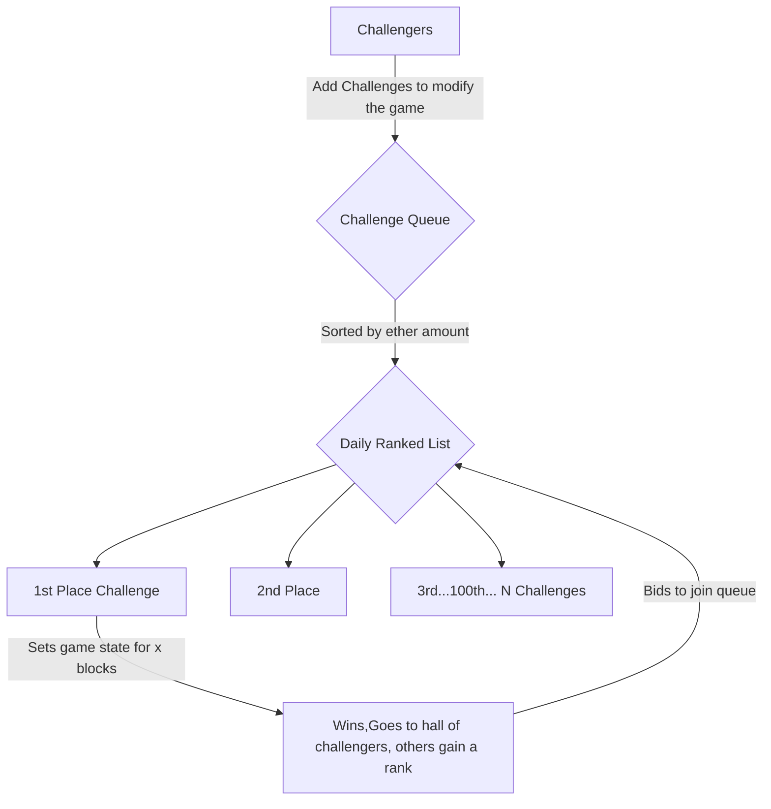

# Congratulations, 🔗 Survivor 🏆 !

Welcome to **OnChain Survivor** Official Repository ! Congratulations on making it this far, You survived every hack, every rug, every fork and every twist in the crypto journey. 🚀💪 Keep pushing forward! 🌟🔥

 🌐🎮 The usage of AI in the development of this game is not just encouraged but considered mandatory. Fun, simplicity, decentralization, and openness are the foundational pillars of the project!

## 🌟About Onchain Survivor🌟

Onchain Survivor is a web-based top-down survival game that utilizes AI in tanden with Web3 technologies to enable a new kind of browser gaming experience. Players will navigate an AI generated environment to do what they do best... Survive! Onchain Survivor aims to combine the addictive gameplay of roguelite games with the innovative potential of generative AI and blockchain technology, creating a unique and engaging experience. 

## The problem & the solution: The Challenger system, Blockchain Integration 🔗 & Game Design 🏟️

In the near future, players will be capable to create with all kinds of experiences with just one prompt using GenAI technology, being able to totally inmerse in virtual worlds beyond human imagination. this brings the problem of such beautiful generated experiences being "isolated" from the rest of their communities or peers, and this a problem blockchains actually can solve.

Onchain survivors uses the "Challenger System", in which a user sends a challenge into a queue of user generated challenges, utilizing blockchain technology to keep track of current and previous records. These challenges are essentially the main gameplay loop that will be executed during x blocks. This means that all players will enjoy the same challenge! resulting in a more shared and consensus based generative experience. This auction based model, also gives chances for all players who sent challenges in the queue to eventually set the game for a day!

## 🌌  Development Roadmap 🛠️ Vision: Locally AI Generated Interactive Worlds 🌌

Onchain Survivor envisions a future where gameplay is entirely generated LOCALLY by AI, blurring the lines between player input and immersive generative experiences. Initially, currently a blend of human creativity and AI assists in producing game assets, but the long-term goal is to transition to systems capable of rendering interactive worlds in real-time based on user-defined prompts. 

This evolution begins with semi-autonomous tools such as neural style transfer and procedurally generated assets, progressively integrating more advanced AI capable of orchestrating gameplay dynamics, art, sound, and storytelling simultaneously. By leveraging blockchain technology to synchronize and preserve these experiences, the game ensures that players share a cohesive and decentralized narrative.

### 🥇 Phase 1 🥇: Daily Challenges, by players for players!

This  system allows users to add their challenges to the Challenge queue. The system is a queue, with each user placing their challenges aiming for the top positions on the leaderboard. The structure is dynamic and ONLY the number one in the queue becomes the main challenger for the next day!. 

**Setting Challenges**: Users submit challenges into the global queue. The challenge values determine the ranking, where the highest one of the day secures the first position and the game state, while the second-highest becomes the next in line, and so on until all ranks are fille,  ensuring opportunities for all participants.

**Daily Rank up**: Every n Blocks, the top-ranked challenge in the queue becomes the game state for the set period of time, making room for the second-highest to claim the number one spot. All other positions advance one spot too!

**Adding**: If the previous day's top-ranked in the Challenge Queue wants to secure the first rank again, they must re add with a higher amount to reclaim their position and set the game Challenge for consecutive days.

This system ensures fairness by regularly refreshing the queue, preventing any one user from monopolizing the top position.

### Phase 2: Multiple games, all using the same Challenge Queue!

As additional game "templates"  or models are developed and integrated into the main client, they will all operate on the same underlying smart contract for the challenge queue. This means setting a challenge for one game will simultaneously apply to multiple games! I figured it would be a very fun experience to set a challenge for my favorite game, and see what kind of challenge gets generated across different other games. However, specific design constraints must be maintained to ensure the games remain coherent with one another trought the challenges.

### Phase 3: User generated real time experiences, from locally run neural networks. 

Currently, GenAI videos rendered on top of completed games offer a glimpse into the future of gaming and the styles of challenges in the game is done using typical computer graphics technologies, like custom shaders and materials. for Onchain survivor, Challengers will be able to choose an style and the general gameplay, then using fast style transfer technology, it will adapt it into the main gameplay loop by re-rendering each frame in real time as it is being executed, allowing Challengers to "modify" the game as they desire using these technologies, and have all the others survivors enjoy it too at the same time. Onchain Survivor plans to eventually (Realistically a couple of years)  implement wathever open-source, real-time technology becomes the most qualified for this job to enable this experience.

## Art Style 🎨 & Sound Design 🎵

Any kind of submissions are welcomed as long as they are coherent!, theres no dead set art and musical style being planned in the long term, so even if current version is being made in 3D with basic music, with the usage of neural style transfer for rendering in real time and AI generatic music in the future will allow for different styles to be applied. 

##  📚  Interaction Models 🕹️

As frictionless and simple as possible, No wallet required to play, the game's first priority is FUN. If the game is not fun then it will not be sustainable! 

### ⏱️Prerequisites⏱️
- Currently it should run in 4 years old hardware. Optimization is always an ongoing process, so please be patient.
- a Web3 Wallet 

## 🚀Getting Started🚀 & 💿Installation💿
- Download the client and open index.html in your local server, or visit https://onchainsurvivor.pages.dev.

In the future ill aim for the game to not need a server nor internet based dependencies as code gets cleaner.

A Web3 Wallet is required to participate in the ranks!

## 🤝Contributing🤝

Contributions from everyone are welcomed! You can contact me directly, make a proposal directly in github. I am really focusing adding content into the game, but you can ping me on twitter to notify me about your contribution. 

1.  **Fork the Repository**
2.  **Create a New Branch**
3.  **Commit Your Changes**
4.  **Push to the Branch**
5.  **Open a Pull Request**

## 📜License📜 

This project license is [TBD]. 

## 🙏 Acknowledgments ❤️

-   **Three js**: For the amazing engine ❤️.
-   **Web3 js**: For simplifying blockchain interactions ❤️.
-   **OpenAI ChatGPT**: Best AI. For making development great again ❤️.
-   **Microsoft Copilot**: Best Artist i've ever known ❤️.
-   **Adobe Mixamo**: Best 3D Animator ❤️.
-   **Meshy.ai**: Best 3D Modeler ever ❤️, under the https://creativecommons.org/licenses/by/4.0/ License.
-   **Tensor Flow**:Best Neural Style transfer tool ❤️

## 📬 Contact

Have questions? Feel free to reach out!

-   **Telegram**: [@OnChainSurvivor] https://t.me/OnchainSurvivor
-   **Twitter**:  [@OnChainSurvivor](https://twitter.com/onchainsurvivor)

Thank you for visiting our repository! I hope you enjoy Onchain Survivor as much as I enjoy developing it. Happy surviving! 🌍🎮

## 📬 Contact

My public addresses, in case a kind soul wants to make a donation! 

BTC:
bc1p5qg2972ksyk2uc29nky4kapkm9tr6nmqjes9caxgs4esdtzk0frs0ul527

ETH - Base, Arbitrum, Optimism, Linea and so on:
0xBC321C9EcBd7FC3A5867DE8db50f38AEe9011415

Solana:
8YDRKsVQxe3wmVifX39rM2qv7qqJwUaTEh7TXiu4tFg1

Dogecoin:
DJExfzzy6KacVuHHodj7FgQaRPtxnMqR2Y

Cardano Address:
addr1q9qqjsumzss320vhuqgfdmx9kc7gwxhukqf9qcmzd2cy9pytkv39w340zrmvp6erg5fyqegxt3qfvvuaeccfj98taryq0ezutk

XRP:
rJjSrrdJt6qjAsyShjnUCJ6PULUUBivRpb

Tron:
TUCo6gDtMssHmNpo9qDCAdJkT15QDFyBUh

Litecoin:
ltc1qt9zsxdur80ava2hp0y53s9l6kf63u2w0r8jc97
