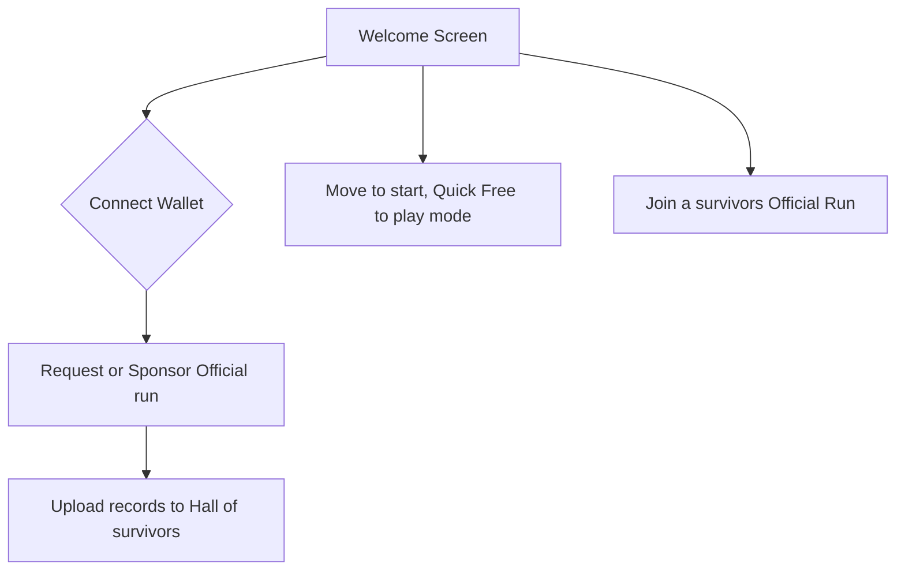
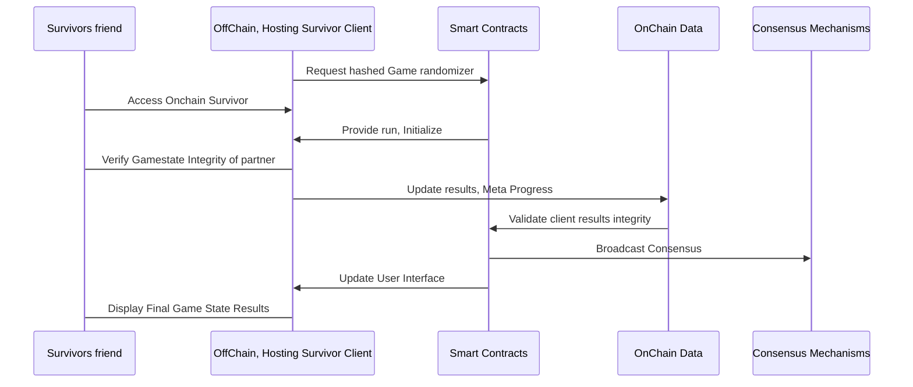

# Congratulations, 🔗 Survivor 🏆 !

Survivor! Congratulations on making it this far, You survived every hack, every rug, every fork and every twist in the crypto journey. 🚀💪 Keep pushing forward! 🌟🔥

## Onchain Survivor🔗🏆

Welcome to **OnChain Survivor** Official Repository ! 🌐🎮 The usage of AI in the development of this game is not just encouraged but considered mandatory. Fun, simplicity, decentralization, and openness are the foundational pillars of the project.

## 🌟About the Project🌟

Onchain Survivor is a web-based top-down arena shooter survival roguelite game that utilizes Web3 technologies to enable Open Source, decentralized, peer-to-peer multiSurvivor interactions. Navigate a 3D Blockchained environment to do what they do best... Survive Together!

### 🔑Key Features🔑

- **Decentralized Gameplay**: Enjoy a truly decentralized multiSurvivor experience with peer-to-peer connections. No central server required.  You can keep a copy of the client and fire it up connecting with a friend!. 
- **Blockchain Integration**: Interact with the dynamic blockchain technology and data, The game uses block data to generate the difficulty.  
- **3D Graphics**: Experience immersive 3D graphics powered by Three.js, in any browser.
- **Cross-Platform**: Survive directly Either desktop or mobile, without the need for additional hardware. Simple is best. You can even play from your wallet!
- **Variable Gameplay**: Every experience is different, Guaranteed. 
- **Meta Progress**: As the game progresses and the user plays more of the game, he discovers unlocks classes, powerups. 

## 😈👺Onchain Survivor Dynamic Difficulty Scaling👺😈

The *Onchain Survivor Dynamic Difficulty Scaling  function* will be satisfying gameplay up until minute 30. We'll assume the difficulty increases exponentially until the end. Depending on several accounting factors related to both the Players $P$ and the blockchain $B$. Let  $D(t)$  be the difficulty at time  $t$.   The final difficulty can be modeled as:

$D(t) = D_0 e^{kt} +α(Pavg​−P(t)+βB(t))$

where:

-   $D0$  is the initial difficulty at  $t=0$,
-   $k$  is a constant that determines the rate of difficulty increase.
-   $α$  is a scaling factor for the performance adjustment,
-   $Pavg​$  is the average expected performance,
-   $P(t)$  is the player's performance at time  $t$.
- $β$  is a scaling factor for the blockchain-derived difficulty,
- $B(t)$  is the difficulty factor extracted from the latest blockchain block.

Note:  Random difficulty factor $B(t)$ that is extracted from the latest block in the blockchain. The factor $B(t)$ could be based on various metrics from the blockchain, such as transaction volume, block size, or other relevant activities. The term $βB(t)$ allows the difficulty to adapt dynamically based on real-time blockchain data, adding an element of unpredictability and aligning with the decentralized nature of blockchain games. 

##  📚 Basic Interaction Models 🕹️

As frictionless as possible, the game's first priority is FUN. 

## 🚀Getting Started🚀 

Follow these steps to set up Onchain Survivor on your local machine:

### ⏱️Prerequisites⏱️
- Currently tests should easily run in 10 years old hardware.

### 💿Installation💿
- Download the client release and open index.html in your local server, or visit https://onchainsurvivor.pages.dev

## 🎮How to Survive🎮

-   **Connect wallet, and Request a run from the Hall of survivors**
-   **OR Join a run**: Enter an address and click "Join Room" to connect with survivor currenly playing.
-   **Move Your survivor**: Use the arrow keys, on screen joystick, WASD or IJKL to move your character around the 3D environment.
-   **Upgrade, evolve, fork, Survive**: Your movements and decisions will be broadcast to your partner in real-time. Every choice affects your gameplay. Every Ability you choose is significant, so choose wisely.

## 🤝Contributing🤝

Contributions from everyone are welcomed! You can contact me directly, make a proposal directly in github. I am really focusing adding content into the game, but you can ping me on twitter to notify me about your contribution. 

1.  **Fork the Repository**
2.  **Create a New Branch**
3.  **Commit Your Changes**
4.  **Push to the Branch**
5.  **Open a Pull Request**

## 📜License📜 

This project license is currently [TBD]. 

## 🙏 Acknowledgments

-   **Three js**: For the amazing engine ❤️.
-   **Web3 js**: For simplifying blockchain interactions ❤️.
-   **OpenAI ChatGPT**: For making development great again ❤️.
-   **Microsoft Copilot**: Best Artist i've ever known ❤️.
-   **Adobe Mixamo**: Best 3D Animator ❤️.
-   **Meshy.ai**: Best 3D Modeler ever ❤️, under the https://creativecommons.org/licenses/by/4.0/ License

## 📬 Contact

Have questions? Feel free to reach out!

-   **Twitter**:  [@OnChainSurvivor](https://twitter.com/onchainsurvivor)

Thank you for visiting our repository! We hope you enjoy Onchain Survivor as much as we enjoy developing it. Happy surviving! 🌍🎮