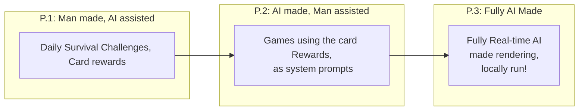

## Congratulations, Survivor!

Welcome to the official Onchain Survivor repository! Congratulations on making it this far, you’ve navigated every challenge along your crypto journey. Keep pushing forward! Our project is built on the principles of fun, simplicity, decentralization, and openness.

OnChain Survivor is a browser top-down survival game, that leverages artificial intelligence in tandem with Web3 technologies to deliver a fresh gaming experience. Players navigate dynamically generated environments where the main goal is simple: survive. We combine engaging roguelite gameplay with the potential of AI and the security of blockchains to create a unique and immersive experience.

## The Problem & The Solution: The daily challenger, Integrations, & Game Design
Soon, players will be able to generate diverse experiences with a single prompt using advanced AI. While this capability can unlock incredibly immersive virtual worlds, it also risks isolating these creations from broader communities. By incorporating blockchain technology, we aim to connect and share these experiences, ensuring they become part of a larger, interactive ecosystem.

OnChain Survivor employs a "Challenger System" where players submit challenges into a shared queue. Blockchain technology is used to record both current and past challenges, ensuring transparency and integrity. The challenge at the top of the queue becomes the gameplay prompt for a fixed period (measured in blockchain blocks), meaning all players engage with the same challenge and share a unified experience. This mechanism works like an auction: as challenges are submitted, they are ranked, giving every participant the opportunity to have their challenge selected as the daily prompt.

## Development Roadmap: Towards Locally Generated AI Worlds

OnChain Survivor aims to evolve into a fully local AI-driven experience, where game environments and content are generated in real time based on consensus inputs. In the short term, the project will combine human creativity with AI-assisted asset production, laying the foundation for a gradual transition toward fully interactive, real-time worlds.

The evolution will begin by incorporating semi-automated tools, such as neural style transfer and procedural asset generation—and will progressively integrate more advanced AI systems capable of managing gameplay dynamics, visual design, audio, and narrative concurrently. Blockchain technology will be used to record and synchronize these experiences, ensuring that all players share a consistent, verifiable narrative.

###  Phase 1 : Daily Challenges, by players for players!

In this phase, players directly influence the daily game experience by submitting challenges to a centralized, blockchain-managed queue. Each submission is recorded transparently, and challenges are ranked by the Ether amount attached to them. Only the top-ranked challenge becomes the active game prompt for a fixed period measured in blockchain blocks, ensuring a competitive and fair environment.

**Challenge Submission**:
Players submit challenges to modify the game. Each challenge is added to a centralized queue maintained on the blockchain.

**Ranking Process**:
The challenges are then ranked based on the amount of Ether submitted, forming a daily ranked list.

The top-ranked (first place) challenge is selected to define the game state for a predetermined number of blocks.
Once a challenge is selected, it is recorded in the system, and all other challengers move up in rank, creating ongoing opportunities for new challenges to be submitted and ranked.

**Daily Rank up**: Every n Blocks, the top-ranked challenge in the queue becomes the game state for the set period of time, making room for the second-highest to claim the number one spot. All other positions advance one spot too!

This system ensures fairness and continuous engagement by refreshing the challenge queue regularly and offering all players a chance to shape the game.

## Phase 2: Shared Challenge Queue Across Multiple Games
Additional game templates will share the same smart contract-managed challenge queue. A challenge submitted for one game will automatically apply to all, creating a unified experience—while design constraints ensure that each game remains coherent.

## Phase 3: Real-Time, Locally Driven AI Experiences
Future updates will allow players to modify game visuals and gameplay in real time. Using advanced style transfer techniques, the game will render each frame live according to player-selected styles. This builds on current demonstrations like GenAI-rendered videos, with plans to adopt leading open-source real-time technologies as they mature.

## Art & Sound
Art and music submissions are welcome without strict style guidelines. While the current version uses basic 3D graphics and simple music, future iterations will integrate neural style transfer and AI-generated music to offer diverse, evolving artistic experiences

## Interaction Models 

### Prerequisites
- Currently it should run in 4 years old hardware. Optimization is always an ongoing process, so please be patient.
- A Web3 Wallet to participate in the ranks 

## Getting Started & Installation
- Download the client and open index.html in your local server, or visit https://onchainsurvivor.pages.dev
- A Web3 Wallet is required to participate in the ranks!

## Contributing

Contributions from everyone are welcomed! You can contact me directly, make a proposal directly in github. I am really focusing adding content into the game, but you can ping me on twitter to notify me about your contribution. 

1.  **Fork the Repository**
2.  **Create a New Branch**
3.  **Commit Your Changes**
4.  **Push to the Branch**
5.  **Open a Pull Request**

## License

[TBD]. 

## 🙏Acknowledgments ❤

-   **Three js**: engine ❤.
-   **Web3 js**: blockchain interactions ❤.
-   **OpenAI ChatGPT**: ai ❤.
-   **Microsoft Copilot**:  art ❤.
-   **Adobe Mixamo**: 3d animator ❤.
-   **Meshy.ai**: low poly 3d modeler ❤, under the https://creativecommons.org/licenses/by/4.0/ License.
-   **Tensor Flow**: neural style transfer tool ❤ 

## Contact

 Feel free to reach out!

-   **Twitter**:  [@OnChainSurvivor](https://twitter.com/onchainsurvivor)

Thank you for visiting! I hope you enjoy Onchain Survivor as much as I enjoy developing it. Happy surviving! 

## Donations

My public addresses, in case a kind soul wants to make a donation! 

BTC:
bc1p5qg2972ksyk2uc29nky4kapkm9tr6nmqjes9caxgs4esdtzk0frs0ul527

ETH - Base, Arbitrum, Optimism, Linea and so on:
0xBC321C9EcBd7FC3A5867DE8db50f38AEe9011415

Solana:
8YDRKsVQxe3wmVifX39rM2qv7qqJwUaTEh7TXiu4tFg1

Dogecoin:
DJExfzzy6KacVuHHodj7FgQaRPtxnMqR2Y

Cardano Address:
addr1q9qqjsumzss320vhuqgfdmx9kc7gwxhukqf9qcmzd2cy9pytkv39w340zrmvp6erg5fyqegxt3qfvvuaeccfj98taryq0ezutk

XRP:
rJjSrrdJt6qjAsyShjnUCJ6PULUUBivRpb

Tron:
TUCo6gDtMssHmNpo9qDCAdJkT15QDFyBUh

Litecoin:
ltc1qt9zsxdur80ava2hp0y53s9l6kf63u2w0r8jc97
